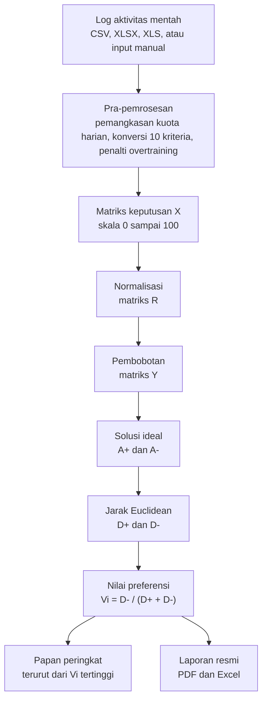

# SPK SEBUSE — Pemeringkatan Corporate Wellness Program dengan Metode TOPSIS

Aplikasi web Sistem Pendukung Keputusan untuk menentukan peringkat peserta event
SEBUSE (Sehat, Bugar, Senang) di PT Cahaya Suara Utama, memakai metode
*Technique for Order of Preference by Similarity to Ideal Solution* (TOPSIS).

Dibangun sebagai tugas akhir Program Studi Teknik Informatika, Universitas
Indraprasta PGRI.

## Masalah yang Diselesaikan

Panitia event SEBUSE sebelumnya merekap penilaian secara semi-manual memakai
spreadsheet, untuk sepuluh kriteria aktivitas fisik sekaligus. Cara tersebut
memunculkan tiga masalah: rekapitulasi memakan waktu lama, penilaian rentan
salah hitung, dan pesertanya tidak dapat memeriksa dasar penilaiannya sendiri.

Aplikasi ini mengambil alih seluruh perhitungan tersebut, lalu menampilkan
setiap tahapannya kepada panitia maupun peserta.

## Cara Kerja

Data mentah aktivitas olahraga masuk melalui unggahan berkas rekap atau
pencatatan manual. Aplikasi kemudian mengubahnya menjadi matriks keputusan
berskala seragam, menghitung peringkat memakai TOPSIS, lalu menyajikan hasilnya.



Keenam tahapan TOPSIS tersebut tidak disembunyikan. Aplikasi menampilkan
matriks X, R, Y, solusi ideal, jarak Euclidean, dan nilai preferensi pada satu
halaman rincian komputasi, sehingga hasilnya dapat diperiksa ulang secara manual.

### Sepuluh kriteria penilaian

Seluruh kriteria bertipe *benefit*, yaitu semakin tinggi nilainya semakin baik.

| Kode | Kriteria | Bobot | Aturan |
|---|---|---|---|
| C1 | Total Poin Cardio | 20% | 1 sesi = 2 poin, target 24 poin sebulan |
| C2 | Total Poin Strength | 15% | 1 sesi = 2 poin, target 16 poin sebulan |
| C3 | Ketuntasan Long Run | 15% | 2× tuntas 10 KM = 100, 1× = 50, 0× = 0 |
| C4 | Syarat Mingguan | 10% | minimal 2 cardio + 1 strength per minggu |
| C5 | Bonus Mingguan | 10% | 3 cardio + 2 strength dalam satu minggu |
| C6 | Aturan Beruntun | 10% | maksimal 3 hari cardio berturut-turut, penalti 25 per rentetan |
| C7 | Hasil Pengukuran Akhir | 5% | progres berat badan atau BMI, dinilai panitia |
| C8 | Poin Fun Sports | 5% | 1 sesi = 1 poin, kuota 4 poin sebulan |
| C9 | Disiplin Harian | 5% | maksimal 4 poin sehari |
| C10 | Kualitas Evidence | 5% | rasio bukti valid terhadap seluruh unggahan |

Angka pembanding pada aturan tersebut, misalnya target 24 poin dan batas 3 hari
beruntun, tersimpan sebagai dua belas parameter pada tingkat event. Panitia
karena itu dapat menyesuaikan regulasi melalui antarmuka tanpa mengubah kode
program.

### Tiga peran pengguna

| Peran | Kewenangan |
|---|---|
| Super Admin | Mengelola akun pengguna dan bobot kriteria, serta seluruh kewenangan Admin Panitia |
| Admin Panitia | Mengelola peserta dan log aktivitas, menjalankan perhitungan, mencetak laporan |
| Peserta | Melihat papan peringkat dan rincian skor miliknya sendiri |

Pembatasan kewenangan diterapkan pada tingkat pengendali, bukan sekadar
disembunyikan pada tampilan menu.

## Kebenaran Perhitungan

Keluaran mesin perhitungan dibandingkan dengan hasil perhitungan manual pada
naskah tugas akhir, sampai empat angka desimal.

| Kode | Peserta | D⁺ | D⁻ | Nilai Vᵢ | Peringkat |
|---|---|---|---|---|---|
| A5 | Eka | 0,0078 | 0,0696 | 0,8988 | Juara 1 |
| A2 | Andi | 0,0139 | 0,0623 | 0,8182 | Juara 2 |
| A1 | Budi | 0,0178 | 0,0570 | 0,7618 | Juara 3 |
| A3 | Citra | 0,0429 | 0,0330 | 0,4350 | Peringkat 4 |
| A4 | Dedi | 0,0709 | 0,0000 | 0,0000 | Peringkat 5 |

Angka tersebut diperiksa ulang setiap kali pengujian dijalankan, meliputi
sepuluh pembagi normalisasi, matriks R, solusi ideal, jarak Euclidean, dan nilai
preferensi.

```bash
bundle exec rspec
```

Jumlah pengujiannya 181 contoh. Berkas `spec/services/topsis_engine_spec.rb`
merupakan yang terpenting, karena berkas itulah yang mengunci kesesuaian hasil
aplikasi terhadap perhitungan manual.

## Cara Memasang

### Kebutuhan

| Komponen | Versi |
|---|---|
| Ruby | 3.3 |
| Ruby on Rails | 8.1 |
| PostgreSQL | 16 |

Pengembangan dilakukan pada Windows 11 melalui WSL2 Ubuntu. Linux dan macOS
dapat memakai langkah yang sama, tanpa langkah WSL.

### 1. Paket pendukung

```bash
sudo apt update
sudo apt install -y build-essential libpq-dev libyaml-dev pkg-config curl git
```

Paket `libpq-dev` diperlukan gem `pg`. Tanpa paket tersebut, `bundle install`
akan gagal.

### 2. PostgreSQL

```bash
sudo apt install -y postgresql postgresql-client
sudo service postgresql start
sudo -u postgres createuser -s "$USER"
pg_isready
```

### 3. Ruby melalui mise

```bash
curl https://mise.run | sh
echo 'eval "$(~/.local/bin/mise activate bash)"' >> ~/.bashrc
exec bash
```

### 4. Aplikasi

```bash
git clone https://github.com/sulaeman-eman/spk-sebuse-topsis.git
cd spk-sebuse-topsis
mise install
bundle install
bin/rails db:create db:migrate db:seed
bin/rails server
```

Aplikasi kemudian dibuka pada `http://localhost:3000`.

### Akun contoh

Perintah `db:seed` memuat sepuluh kriteria beserta bobotnya, satu event SEBUSE
2026, lima peserta beserta matriks keputusannya, dan tiga akun berikut. Kata
sandi ketiganya `sebuse2026`.

| Peran | Alamat email |
|---|---|
| Super Admin | `superadmin@cahayasuarautama.co.id` |
| Admin Panitia | `panitia@cahayasuarautama.co.id` |
| Peserta | `peserta@cahayasuarautama.co.id` |

Ganti ketiga kata sandi tersebut sebelum aplikasi dipakai pada kegiatan yang
sebenarnya.

### Urutan pemakaian

1. Masuk sebagai Admin Panitia.
2. Periksa menu **Kriteria**, pastikan penandanya menyatakan total bobot 100%.
3. Daftarkan peserta pada menu **Peserta**.
4. Masukkan log aktivitas melalui menu **Impor Log**, atau catat satu per satu.
5. Jalankan **Pre-processing** untuk membentuk matriks keputusan.
6. Tekan **Hitung TOPSIS**, lalu periksa halaman rincian komputasinya.
7. Buka **Peringkat**, kemudian cetak laporannya bila diperlukan.

Langkah 5 wajib mendahului langkah 6. Aplikasi menolak perhitungan apabila
matriks keputusan belum terbentuk, atau akumulasi bobot kriteria bukan 100%.

### Catatan mode aplikasi

Aplikasi dijalankan pada mode *development*. Mode *production* menetapkan
`config.force_ssl = true` yang mewajibkan sambungan HTTPS, sedangkan peladen
lokal hanya menyediakan HTTP biasa.

## Susunan Kode

```
app/services/topsis_engine.rb          kalkulasi TOPSIS, murni matematis
app/services/preprocessing_engine.rb   konversi log mentah ke matriks keputusan
app/services/topsis_run_creator.rb     jembatan basis data dengan mesin hitung
app/services/activity_log_import.rb    pembacaan berkas rekap CSV dan Excel
app/services/report_generator.rb       penyusun laporan PDF dan Excel
app/controllers/                       lima belas pengendali
db/migrate/                            sembilan tabel basis data
spec/                                  181 contoh pengujian
script/                                penyusun dokumen dan paket penyerahan
```

`TopsisEngine` sengaja tidak menyentuh ActiveRecord. Masukannya larik angka
biasa dan keluarannya objek hasil, sehingga kebenaran matematikanya dapat diuji
langsung terhadap matriks keputusan pada naskah tanpa membuat satu pun data di
basis data.

Antarmuka memakai CSS yang ditulis langsung tanpa kerangka kerja, sehingga tidak
ada tahap *build* aset.

## Berkas yang Tidak Diikutkan

Repositori ini memuat kode sumber beserta pengujiannya. Ketiga direktori berikut
tercantum pada `.gitignore`, karena isinya memuat naskah tugas akhir beserta data
pribadi penulis, dan berubah setiap kali revisi diterapkan.

| Direktori | Isi | Cara menyusun ulang |
|---|---|---|
| `docs/` | Naskah revisi, gambar, manual pengguna, tata cara penggunaan | `ruby script/build_manual.rb NAMA_DOKUMEN.md` lalu `script/build_manual_pdf.sh` |
| `app_info/` | Manual book dan daftar kredensial akun | perintah yang sama seperti di atas |
| `pengumpulan/` | Paket penyerahan beserta lampiran listing program | `ruby script/build_submission.rb` |

Skrip penyusunnya tetap dilacak, sehingga seluruh dokumen tersebut dapat disusun
ulang dari kode sumber ini.

## Teknologi

Ruby 3.3, Ruby on Rails 8.1, PostgreSQL 16, RSpec, Prawn untuk PDF, dan Caxlsx
untuk Excel.
