# Manual Pengguna

## Sistem Pendukung Keputusan Penentuan Peringkat Corporate Wellness Program pada Event SEBUSE PT Cahaya Suara Utama dengan Metode TOPSIS

Dokumen ini menjelaskan cara menjalankan dan menggunakan purwarupa aplikasi
Sistem Pendukung Keputusan (SPK) yang dibangun pada penelitian tugas akhir.
Seluruh tangkapan layar diambil dari aplikasi yang berjalan dengan data simulasi
lima peserta sebagaimana tercantum pada Bab IV.

---

## Daftar Isi

| Bagian | Isi |
|---|---|
| A | Ruang Lingkup Dokumen |
| B | Kebutuhan Sistem |
| C | Pemasangan dan Menjalankan Aplikasi |
| D | Akun dan Hak Akses |
| E | Alur Kerja Sistem |
| F | Panduan Penggunaan, UC-01 sampai UC-10 |
| G | Rujukan Aturan Penilaian |
| H | Skenario Demonstrasi Sistem |
| I | Penanganan Masalah |
| J | Ringkasan Pengujian Otomatis |
| K | Glosarium |
| L | Bahan Siap Tempel untuk Laporan |

---

## A. Ruang Lingkup Dokumen

Dokumen ini mencakup:

1. Kebutuhan perangkat lunak dan cara pemasangan.
2. Pembagian hak akses tiga aktor sistem beserta peta menunya.
3. Panduan penggunaan setiap use case (UC-01 sampai UC-10).
4. Rujukan aturan penilaian sepuluh kriteria beserta rumus konversinya.
5. Skenario demonstrasi sistem secara berurutan dari awal sampai peringkat akhir.
6. Penanganan masalah yang umum ditemui.
7. Ringkasan pengujian otomatis sebagai bukti kebenaran perhitungan.
8. Glosarium istilah metode TOPSIS dan istilah sistem.

Seluruh use case UC-01 sampai UC-10 telah tersedia pada purwarupa ini.

### Dokumen terkait

| Dokumen | Isi |
|---|---|
| `PERANCANGAN_BASIS_DATA.md` | Entity Relationship Diagram, Class Diagram, dan spesifikasi sembilan tabel |
| `DRAFT_BAB4_D.md` | Draf kelebihan dan kelemahan penelitian |
| `DRAFT_BAB5.md` | Draf simpulan dan saran |

---

## B. Kebutuhan Sistem

### 1. Perangkat lunak

| Komponen | Versi | Keterangan |
|---|---|---|
| Ruby | 3.3.12 | Dikelola melalui `mise` |
| Ruby on Rails | 8.1.3 | Kerangka kerja aplikasi |
| PostgreSQL | 16 | Basis data |
| Peramban | Chrome, Edge, atau Firefox versi terkini | Antarmuka pengguna |

### 2. Perangkat keras minimum

| Komponen | Spesifikasi |
|---|---|
| Prosesor | Dual core 2 GHz |
| Memori | 4 GB RAM |
| Penyimpanan | 2 GB ruang bebas |

---

## C. Pemasangan dan Menjalankan Aplikasi

Seluruh perintah dijalankan dari direktori utama aplikasi.

### 1. Menyiapkan lingkungan Ruby

```bash
mise install
```

### 2. Memasang pustaka yang dibutuhkan

```bash
bundle install
```

### 3. Menyiapkan basis data beserta data awal

```bash
bin/rails db:create db:migrate db:seed
```

Perintah `db:seed` memuat sepuluh kriteria penilaian beserta bobotnya, satu
event SEBUSE 2026, tiga akun pengguna, dan lima peserta beserta matriks
keputusan sebagaimana Bab IV.

### 4. Menjalankan aplikasi

```bash
bin/rails server
```

Aplikasi dapat diakses melalui peramban pada alamat `http://localhost:3000`.

### 5. Memverifikasi kebenaran perhitungan

```bash
bundle exec rspec
```

Perintah ini menjalankan seluruh pengujian otomatis. Berkas
`spec/services/topsis_engine_spec.rb` secara khusus membandingkan hasil
komputasi sistem dengan perhitungan manual pada Bab IV, meliputi pembagi
normalisasi, matriks R, solusi ideal, jarak Euclidean, dan nilai preferensi.

---

## D. Akun dan Hak Akses

Tiga aktor sistem sesuai use case diagram, dengan kata sandi awal
`sebuse2026` untuk seluruh akun contoh:

| Aktor | Alamat email | Kewenangan |
|---|---|---|
| Super Admin | `superadmin@cahayasuarautama.co.id` | Mengelola akun pengguna (UC-02) dan bobot kriteria (UC-03), serta seluruh kewenangan Admin Panitia |
| Admin Panitia | `panitia@cahayasuarautama.co.id` | Mengelola peserta (UC-04), mengimpor dan mencatat log aktivitas (UC-05), menjalankan pre-processing (UC-06) dan perhitungan TOPSIS (UC-07), mencetak laporan (UC-10) |
| Peserta | `peserta@cahayasuarautama.co.id` | Melihat papan peringkat (UC-08) dan rincian skor pribadi (UC-09) |

Pembatasan hak akses diterapkan pada tingkat pengendali (controller). Pengguna
yang membuka halaman di luar kewenangannya akan dialihkan ke dasbor beserta
pesan peringatan.

### Peta menu dan hak akses

Tanda centang menunjukkan menu tersedia bagi peran tersebut.

| Menu | Use case | Super Admin | Admin Panitia | Peserta |
|---|---|---|---|---|
| Dasbor | – | ✓ | ✓ | ✓ |
| Event | – | ✓ | ✓ | lihat saja |
| Kriteria | UC-03 | ✓ | lihat saja | lihat saja |
| Peserta | UC-04 | ✓ | ✓ | – |
| Impor Log | UC-05 | ✓ | ✓ | – |
| Pre-processing | UC-06 | ✓ | ✓ | – |
| TOPSIS | UC-07 | ✓ | ✓ | – |
| Peringkat | UC-08 | ✓ | ✓ | ✓ |
| Detail Skor | UC-09 | seluruh peserta | seluruh peserta | miliknya saja |
| Cetak Laporan | UC-10 | ✓ | ✓ | – |
| Pengguna | UC-02 | ✓ | – | – |

Super Admin memperoleh seluruh kewenangan Admin Panitia agar dapat menyiapkan
data tanpa berganti akun.

---

## E. Alur Kerja Sistem

Urutan penggunaan sistem oleh panitia mengikuti alur berikut:

1. **Kelola Kriteria dan Bobot** (UC-03) — memastikan akumulasi bobot tepat 100%.
2. **Kelola Data Peserta** (UC-04) — mendaftarkan karyawan sebagai alternatif penilaian.
3. **Memasukkan log aktivitas** — melalui unggahan berkas rekap (UC-05) untuk data
   banyak peserta sekaligus, atau pencatatan manual per baris untuk penyesuaian.
4. **Pre-processing Data** (UC-06) — mengonversi log mentah menjadi matriks keputusan (X) berskala 0–100.
5. **Hitung Metode TOPSIS** (UC-07) — menghasilkan nilai preferensi dan peringkat.
6. **Papan Peringkat** (UC-08) — mengumumkan hasil kepada seluruh peserta.
7. **Cetak Laporan** (UC-10) — mengunduh rekapitulasi resmi berformat PDF atau Excel.

Langkah 4 wajib mendahului langkah 5. Apabila perhitungan TOPSIS dijalankan
tanpa matriks keputusan, sistem menolak dan mengarahkan pengguna kembali ke
halaman pre-processing.

---

## F. Panduan Penggunaan

### 1. UC-01 Login

**Aktor:** Super Admin, Admin Panitia, Peserta

**Langkah:**

1. Buka alamat `http://localhost:3000`. Sistem menampilkan halaman login.
2. Masukkan alamat email dan kata sandi.
3. Tekan tombol **Masuk**.

**Hasil:** Sistem memverifikasi kredensial ke basis data, membuat sesi
pengguna, lalu mengarahkan ke dasbor sesuai peran. Apabila kredensial tidak
valid, sistem menampilkan pesan kesalahan dan pengguna tetap di halaman login.

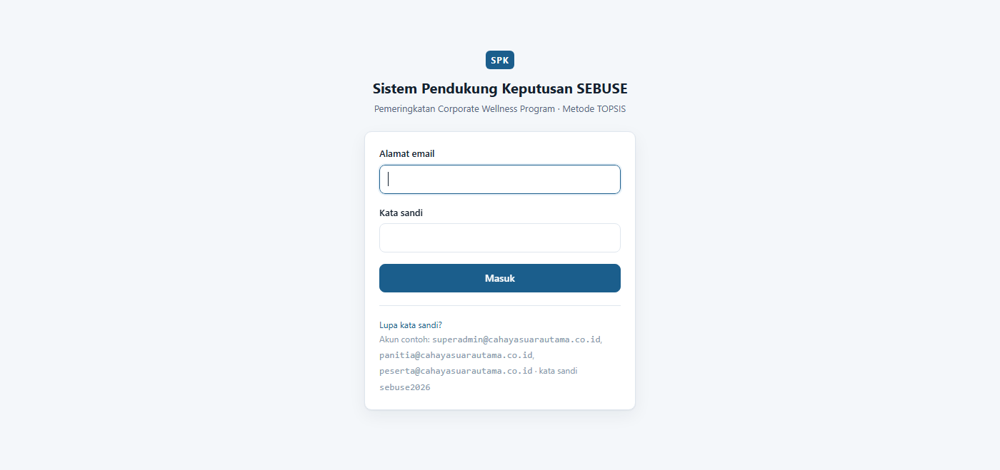

**Gambar 4. 24** Tampilan Halaman Login (UC-01)

---

### 2. Dasbor

**Aktor:** seluruh peran

Dasbor menampilkan ringkasan keadaan event: jumlah peserta, jumlah peserta yang
matriks keputusannya sudah terbentuk, jumlah baris log aktivitas, serta total
bobot kriteria beserta penanda kesiapan perhitungan. Panel kanan menampilkan
lima peringkat teratas hasil perhitungan terakhir dan tautan langkah berikutnya.

Isi dasbor menyesuaikan peran pengguna. Peserta hanya memperoleh tautan menuju
papan peringkat dan rincian skor pribadinya.

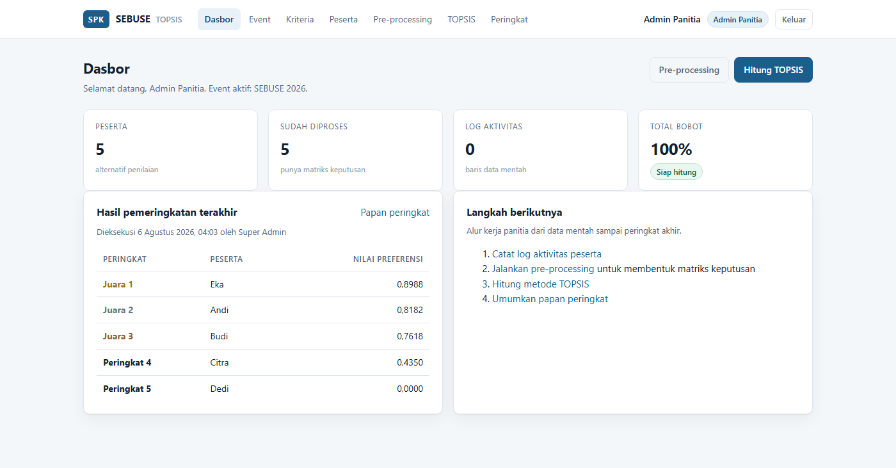

**Gambar 4. 25** Tampilan Dasbor Admin Panitia

---

### 3. UC-02 Kelola Data Pengguna

**Aktor:** Super Admin

**Langkah:**

1. Pilih menu **Pengguna**.
2. Tekan **Tambah pengguna** untuk membuat akun baru, atau **Ubah** pada baris akun yang akan disunting.
3. Isi nama lengkap, alamat email, peran, dan kata sandi.
4. Tekan **Simpan pengguna**.

**Hasil:** Sistem memvalidasi kelengkapan data serta keunikan alamat email,
lalu menyimpannya ke tabel `users`. Pada penyuntingan, kolom kata sandi yang
dibiarkan kosong tidak mengubah kata sandi lama. Akun yang sedang digunakan
tidak dapat dihapus.

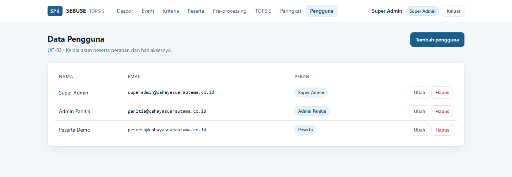

**Gambar 4. 26** Tampilan Kelola Data Pengguna (UC-02)

---

### 4. UC-03 Kelola Kriteria dan Bobot

**Aktor:** Super Admin

**Langkah:**

1. Pilih menu **Kriteria**.
2. Sunting nilai persentase bobot pada kolom **Bobot (%)**.
3. Tekan **Simpan kriteria & bobot**.

**Hasil:** Sistem memeriksa akumulasi seluruh bobot. Apabila totalnya tepat
100%, perubahan disimpan. Apabila tidak, seluruh perubahan dibatalkan dan
sistem menampilkan peringatan agar bobot disesuaikan kembali.

Pemeriksaan dilakukan atas keseluruhan bobot, bukan satu per satu, karena satu
bobot tidak dapat dinilai sahih secara sendirian. Penanda di kanan atas halaman
menunjukkan status kesiapan perhitungan.

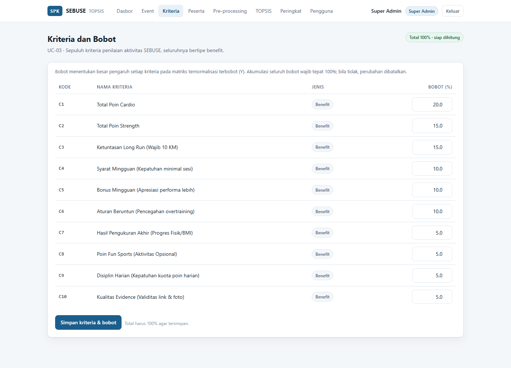

**Gambar 4. 27** Tampilan Kelola Kriteria dan Bobot (UC-03)

---

### 5. UC-04 Kelola Data Peserta

**Aktor:** Admin Panitia

**Langkah:**

1. Pilih menu **Peserta**.
2. Tekan **Tambah peserta**.
3. Isi kode alternatif, NIP, nama, dan departemen. Kode alternatif berikutnya diusulkan otomatis oleh sistem.
4. Pilih akun peserta pada kolom **Akun peserta** agar karyawan tersebut dapat membuka rincian skornya sendiri.
5. Tekan **Simpan peserta**.

**Hasil:** Data peserta tersimpan sebagai alternatif penilaian. Kolom **Skor
terisi** menunjukkan kelengkapan matriks keputusan peserta tersebut.

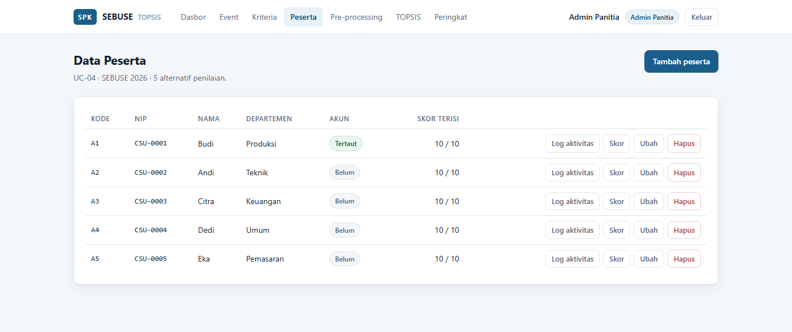

**Gambar 4. 28** Tampilan Kelola Data Peserta (UC-04)

---

### 6. UC-05 Import Log Activities

**Aktor:** Admin Panitia

**Langkah:**

1. Pilih menu **Impor Log**.
2. Tekan **Unduh template CSV** untuk memperoleh contoh berkas beserta nama kolomnya.
3. Isi berkas mengikuti ketentuan kolom, lalu simpan sebagai CSV, XLSX, atau XLS.
4. Tekan **Choose File** dan pilih berkas yang telah disiapkan.
5. Tekan **Import Data**.

**Hasil:** Sistem memeriksa kelengkapan nama kolom, lalu memvalidasi setiap
baris. Bila seluruh baris memenuhi ketentuan, data disimpan sekaligus dan
tercatat sebagai satu batch. Bila ada satu baris yang tidak memenuhi ketentuan,
seluruh berkas dibatalkan dan sistem menampilkan nomor baris beserta alasan
penolakannya.

Pembatalan menyeluruh ini disengaja: panitia tidak perlu menebak sebagian data
mana yang sudah masuk sebelum memperbaiki berkasnya.

**Ketentuan kolom.** Baris pertama berkas wajib memuat nama kolom. Peserta
dicocokkan melalui kolom NIP, sehingga satu berkas dapat memuat data seluruh
peserta sekaligus. Batas satu unggahan adalah 5.000 baris.

| Kolom | Sifat | Keterangan | Contoh |
|---|---|---|---|
| `nip` | wajib | NIP peserta, harus sudah terdaftar pada event | `CSU-0001` |
| `tanggal` | wajib | Tanggal aktivitas, format YYYY-MM-DD | `2026-03-02` |
| `jenis` | wajib | `cardio`, `strength`, `long_run`, atau `fun_sport` | `cardio` |
| `poin` | wajib | Poin aktivitas | `2` |
| `jarak_km` | opsional | Wajib untuk Long Run agar ketuntasannya terhitung | `10.5` |
| `tautan_bukti` | opsional | Tautan Strava atau foto Timestamp | `https://...` |
| `bukti_valid` | opsional | Penilaian panitia atas bukti, diisi `ya` atau `tidak` | `ya` |

Penulisan jenis aktivitas tidak membedakan huruf besar dan kecil, serta
menerima beberapa bentuk umum seperti `Kardio`, `Long Run`, dan `Fun Sports`.

**Pembatalan batch.** Setiap unggahan tercatat pada panel **Riwayat impor**
beserta jumlah baris dan rentang tanggalnya. Tombol **Batalkan batch** menghapus
seluruh baris dari satu unggahan tanpa mengganggu data dari unggahan lain.

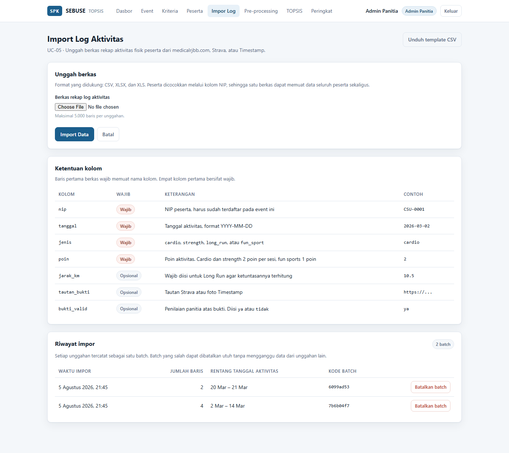

**Gambar 4. 29** Tampilan Import Log Activities (UC-05)

---

### 7. Pencatatan Log Aktivitas secara Manual

**Aktor:** Admin Panitia

**Langkah:**

1. Pada daftar peserta, tekan **Log aktivitas** pada baris peserta yang dimaksud.
2. Tekan **Catat aktivitas**.
3. Isi tanggal, jenis aktivitas, poin, jarak (untuk Long Run), dan tautan bukti.
4. Tandai **Bukti dinyatakan valid oleh panitia** apabila bukti memenuhi syarat.
5. Tekan **Simpan log**.

**Hasil:** Baris log tersimpan sebagai data mentah. Hari yang total poinnya
melampaui kuota harian ditandai pada daftar, dan kelebihannya akan dipangkas
otomatis saat pre-processing dijalankan.

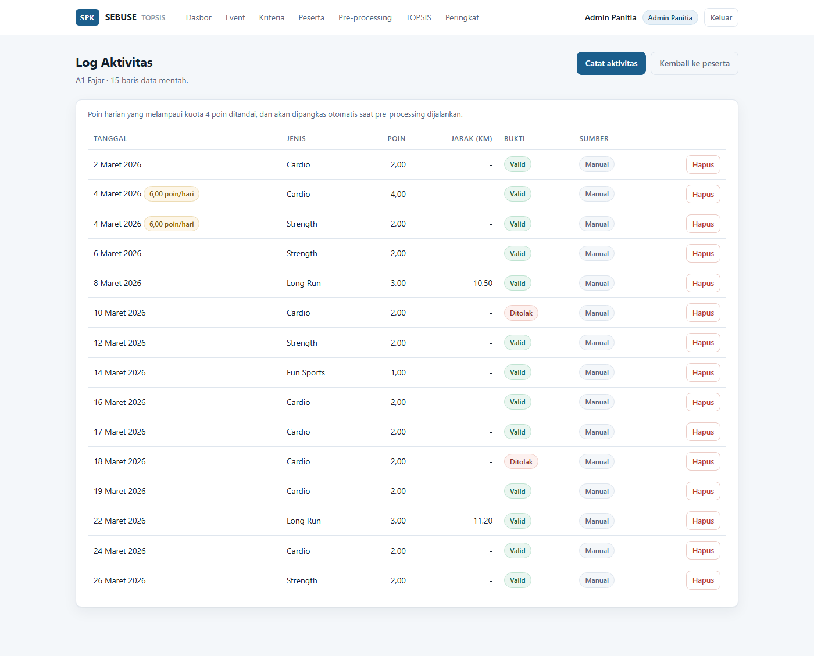

**Gambar 4. 30** Tampilan Pencatatan Log Aktivitas Peserta

---

### 8. UC-06 Pre-processing Data

**Aktor:** Admin Panitia

**Langkah:**

1. Pilih menu **Pre-processing**.
2. Periksa panel **Aturan yang diterapkan** untuk memastikan parameter regulasi sudah sesuai.
3. Tekan **Jalankan pre-processing**.

**Hasil:** Sistem memangkas kuota poin harian yang melampaui batas, mengonversi
setiap kriteria ke skala 0–100 menggunakan rumusnya masing-masing, menghitung
penalti pelanggaran aturan beruntun, lalu menyimpan hasilnya sebagai matriks
keputusan (X). Panel bawah halaman menampilkan pratinjau matriks tersebut.

Nilai kriteria C7 tidak ditimpa oleh proses ini karena bersumber dari
pengukuran fisik oleh panitia, bukan dari log olahraga.

**Perlakuan terhadap peserta tanpa log aktivitas.** Peserta yang belum memiliki
satu pun log aktivitas akan dilewati apabila skornya sudah ada. Ketentuan ini
melindungi nilai yang dimasukkan langsung, misalnya data simulasi lima peserta
Bab IV yang memang tidak memiliki log aktivitas. Tanpa perlakuan tersebut,
menjalankan pre-processing akan mengubah seluruh nilai peserta itu menjadi nol.
Peserta yang belum memiliki log maupun skor akan diisi nol beserta catatan
"Belum ada log aktivitas".

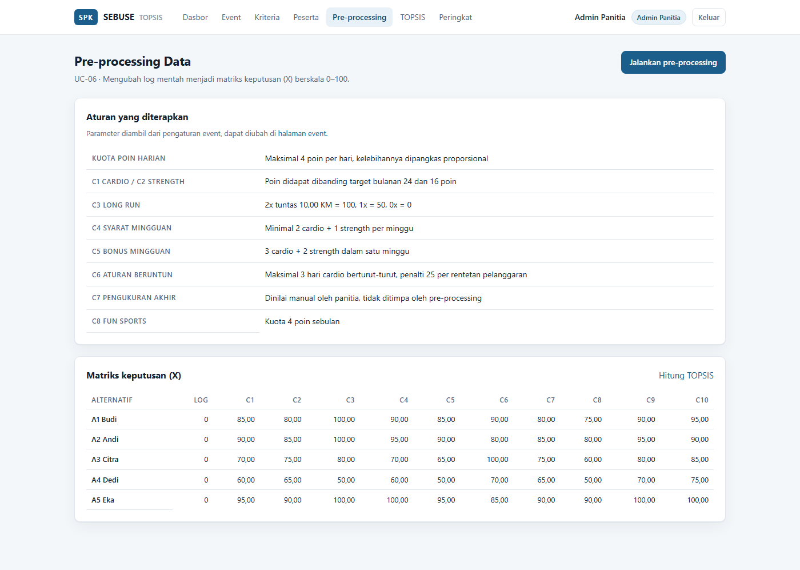

**Gambar 4. 31** Tampilan Pre-processing Data dan Matriks Keputusan (UC-06)

---

### 9. UC-07 Hitung Metode TOPSIS

**Aktor:** Admin Panitia

**Langkah:**

1. Pilih menu **TOPSIS**.
2. Tekan **Hitung TOPSIS**.

**Hasil:** Sistem menyusun matriks keputusan dari basis data, menjalankan
seluruh tahapan TOPSIS, lalu menyimpan hasilnya ke tabel `topsis_runs` dan
`ranking_results`. Pengguna langsung diarahkan ke halaman rincian komputasi.

Setiap eksekusi tercatat beserta waktu dan pelaksananya, sehingga riwayat
perhitungan dapat ditelusuri.

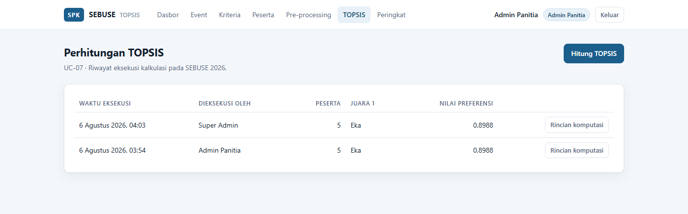

**Gambar 4. 32** Tampilan Riwayat Perhitungan TOPSIS (UC-07)

---

### 10. Rincian Komputasi TOPSIS

**Aktor:** Admin Panitia

Halaman ini menampilkan keenam tahapan perhitungan secara berurutan beserta
rumus yang digunakan:

| Langkah | Keluaran | Rumus |
|---|---|---|
| 1 | Matriks keputusan (X) | hasil pre-processing skala 0–100 |
| 2 | Matriks ternormalisasi (R) | rᵢⱼ = xᵢⱼ / √(Σ xᵢⱼ²) |
| 3 | Matriks ternormalisasi terbobot (Y) | yᵢⱼ = wⱼ × rᵢⱼ |
| 4 | Solusi ideal positif dan negatif | A⁺ = maks kolom Y, A⁻ = min kolom Y |
| 5 | Jarak Euclidean | D⁺ᵢ = √(Σ (yᵢⱼ − y⁺ⱼ)²), D⁻ᵢ = √(Σ (yᵢⱼ − y⁻ⱼ)²) |
| 6 | Nilai preferensi | Vᵢ = D⁻ᵢ / (D⁺ᵢ + D⁻ᵢ) |

Seluruh langkah disimpan sebagai cuplikan (*snapshot*) pada saat eksekusi.
Dengan demikian rincian perhitungan dapat ditampilkan tanpa menghitung ulang,
dan hasil perhitungan lama tetap dapat diaudit walaupun bobot kriteria diubah
setelahnya. Bobot yang dipakai saat eksekusi ditampilkan sebagai penanda pada
langkah ketiga.

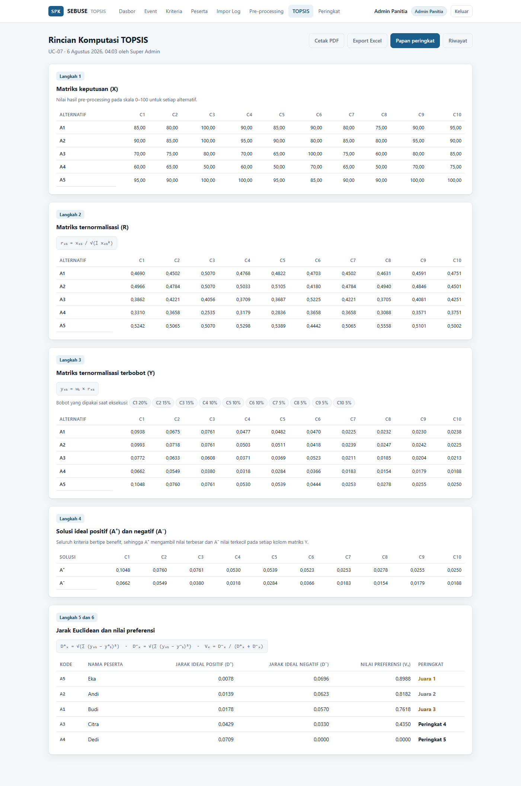

**Gambar 4. 33** Tampilan Rincian Komputasi Metode TOPSIS (UC-07)

---

### 11. UC-08 Lihat Papan Peringkat

**Aktor:** Admin Panitia, Peserta

**Langkah:**

1. Pilih menu **Peringkat**.

**Hasil:** Sistem mengambil hasil perhitungan terakhir dan menampilkan seluruh
peserta terurut dari nilai preferensi tertinggi ke terendah, lengkap dengan
jarak solusi ideal positif dan negatif sebagai bentuk transparansi.

Halaman ini terbuka bagi seluruh peran, sesuai tujuan penelitian dalam
menegakkan transparansi hasil kompetisi.

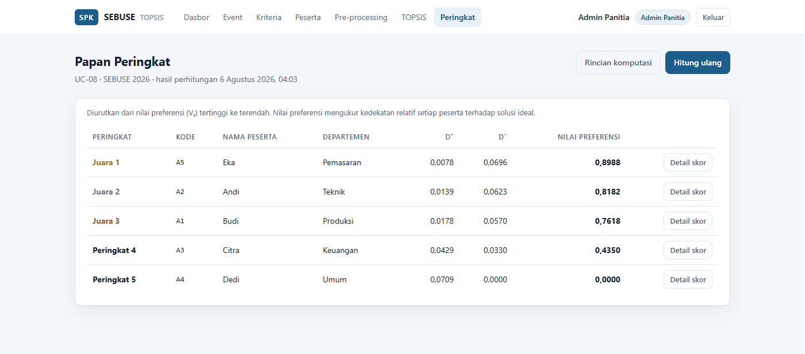

**Gambar 4. 34** Tampilan Papan Peringkat (UC-08)

Bagi pengguna dengan peran Peserta, sistem menambahkan panel ringkasan
peringkat pribadi di bagian atas halaman dan menyorot baris peserta yang
bersangkutan pada tabel.

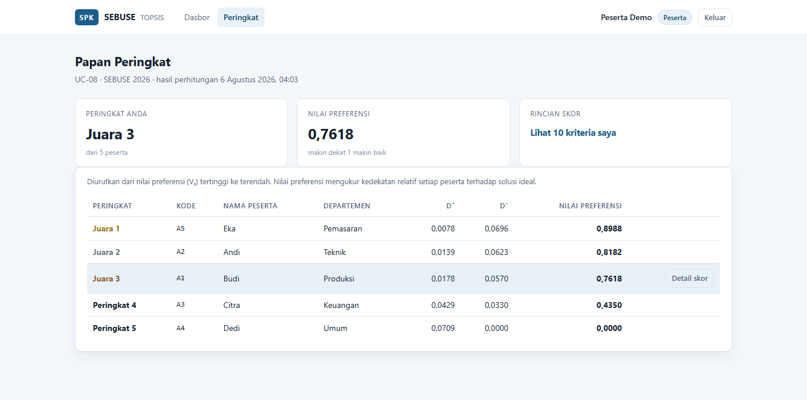

**Gambar 4. 35** Tampilan Papan Peringkat pada Akun Peserta (UC-08)

---

### 12. UC-09 Lihat Detail Skor Individu

**Aktor:** Peserta

**Langkah:**

1. Pada papan peringkat atau dasbor, tekan **Detail skor**.

**Hasil:** Sistem menampilkan rincian capaian sepuluh kriteria milik peserta
beserta bobot, batang capaian, dan catatan evaluasi setiap kriteria. Panel atas
menampilkan peringkat, nilai preferensi, serta jarak terhadap kedua solusi
ideal.

Peserta hanya dapat membuka rincian skor miliknya sendiri. Admin Panitia dan
Super Admin dapat membuka rincian skor peserta mana pun untuk keperluan
verifikasi.

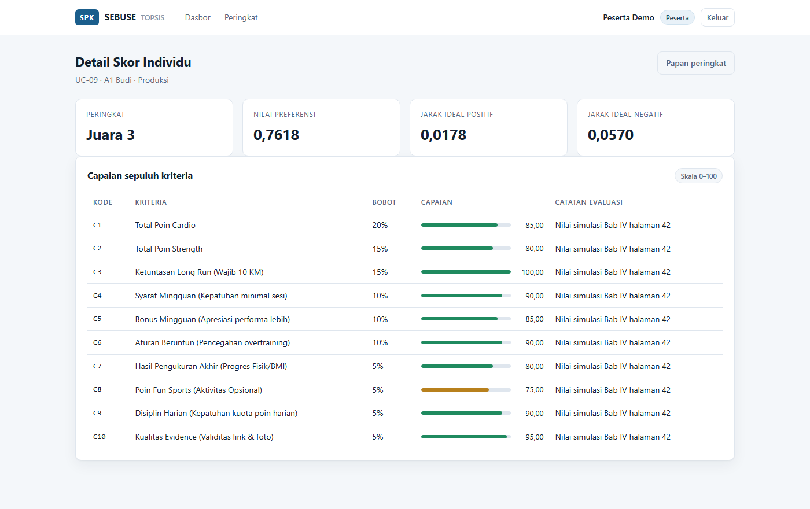

**Gambar 4. 36** Tampilan Detail Skor Individu (UC-09)

---

### 13. UC-10 Cetak Laporan Peringkat

**Aktor:** Admin Panitia

**Langkah:**

1. Buka **Papan Peringkat** atau halaman **Rincian Komputasi**.
2. Tekan **Cetak PDF** untuk dokumen resmi, atau **Export Excel** untuk berkas
   yang dapat diolah lebih lanjut.

**Hasil:** Sistem menyusun laporan dari hasil perhitungan yang tersimpan, lalu
mengunduhkan berkasnya ke perangkat pengguna. Nama berkas memuat nama event dan
waktu perhitungan, misalnya
`laporan-peringkat-sebuse-2026-20260806-0403.pdf`, sehingga laporan dari
perhitungan berbeda tidak saling menimpa.

**Isi laporan PDF.** Satu halaman A4 memuat kop nama perusahaan, judul laporan,
keterangan event, tabel hasil pemeringkatan beserta jarak solusi ideal, tabel
kriteria beserta bobot yang tercatat saat perhitungan, serta ruang tanda tangan
ketua panitia.

**Isi laporan Excel.** Berkas memuat tiga lembar kerja:

| Lembar | Isi |
|---|---|
| Peringkat | Keterangan event dan tabel hasil pemeringkatan |
| Matriks Keputusan | Matriks keputusan (X) serta solusi ideal positif dan negatif |
| Kriteria | Sepuluh kriteria beserta jenis dan bobotnya |

Lembar Matriks Keputusan disertakan agar hasil laporan dapat diperiksa ulang
secara manual, tidak hanya dipercaya apa adanya.

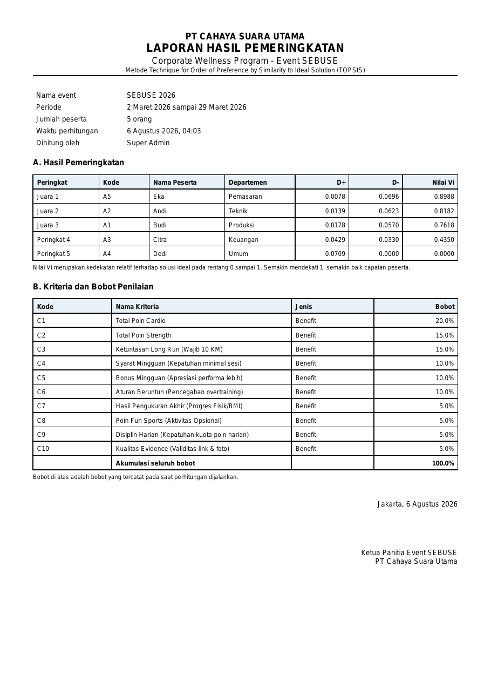

**Gambar 4. 37** Keluaran Laporan Pemeringkatan Berformat PDF (UC-10)

---

## G. Rujukan Aturan Penilaian

Sepuluh kriteria penilaian beserta rumus konversinya ke skala 0–100. Seluruh
kriteria bertipe *benefit*, yaitu semakin tinggi nilainya semakin baik.

| Kode | Kriteria | Bobot | Aturan | Rumus konversi |
|---|---|---|---|---|
| C1 | Total Poin Cardio | 20% | 1 sesi = 2 poin, target 3× seminggu, maksimum 24 poin sebulan | (poin didapat / 24) × 100 |
| C2 | Total Poin Strength | 15% | 1 sesi = 2 poin, target 2× seminggu, maksimum 16 poin sebulan | (poin didapat / 16) × 100 |
| C3 | Ketuntasan Long Run | 15% | wajib 10 KM per dua minggu, dua kali sebulan | 2× tuntas = 100, 1× = 50, 0× = 0 |
| C4 | Syarat Mingguan | 10% | minimal 2 cardio + 1 strength per minggu | (minggu patuh / 4) × 100 |
| C5 | Bonus Mingguan | 10% | 3 cardio + 2 strength dalam satu minggu | (minggu bonus / 4) × 100 |
| C6 | Aturan Beruntun | 10% | maksimal 3 hari cardio berturut-turut | 100 − (jumlah rentetan pelanggaran × 25) |
| C7 | Hasil Pengukuran Akhir | 5% | progres berat badan atau BMI pada akhir periode | skor penilaian panitia, skala 0–100 |
| C8 | Poin Fun Sports | 5% | 1 sesi = 1 poin, kuota 4 poin sebulan | (poin didapat / 4) × 100 |
| C9 | Disiplin Harian | 5% | maksimal 4 poin sehari | (hari patuh kuota / hari aktif) × 100 |
| C10 | Kualitas Evidence | 5% | tautan aktif dan foto bukti jelas | (bukti valid / total unggahan) × 100 |

Catatan penting:

1. **Pemangkasan kuota harian.** Total poin dalam satu hari yang melampaui 4
   poin dipangkas secara proporsional, sehingga komposisi cardio dan strength
   peserta tetap terjaga dan hanya totalnya yang berkurang.
2. **Penghitungan pelanggaran C6.** Yang dihitung adalah rentetannya, bukan
   setiap harinya. Cardio empat hari berturut-turut satu kali berarti satu
   pelanggaran, sehingga nilainya 75, bukan 25.
3. **Pembatasan skala.** Nilai dibatasi pada rentang 0 sampai 100. Capaian yang
   melampaui target tetap bernilai 100, dan penalti yang berlebih berhenti di 0.
4. **Kriteria C7.** Tidak diturunkan dari log olahraga karena bersumber dari
   pengukuran badan. Nilainya diisi manual dan tidak ditimpa oleh
   pre-processing.

Seluruh parameter di atas tersimpan pada tingkat event dan dapat diubah melalui
halaman **Event › Ubah aturan** tanpa mengubah kode program.

---

## H. Skenario Demonstrasi Sistem

Bagian ini menyusun urutan langkah untuk memperagakan seluruh kemampuan sistem
secara berurutan, misalnya pada saat sidang atau serah terima kepada panitia.
Skenario disusun agar setiap use case tampil sekali, dan agar hasil akhirnya
dapat langsung dibandingkan dengan perhitungan manual pada Bab IV.

### 1. Persiapan

```bash
bin/rails db:drop db:create db:migrate db:seed
bin/rails server
```

Data awal memuat dua event:

| Event | Isi | Kegunaan pada peragaan |
|---|---|---|
| SEBUSE 2026 | Lima peserta beserta matriks keputusan Bab IV, tanpa log aktivitas | Memperagakan perhitungan TOPSIS dan membandingkannya dengan Bab IV |
| SEBUSE 2026 (demo pre-processing) | Satu peserta beserta lima belas baris log aktivitas | Memperagakan impor berkas dan pre-processing dari data mentah |

Siapkan pula berkas `docs/contoh/contoh-impor-log-aktivitas.csv` yang akan
diunggah pada langkah 4.

> **Penting.** Peragaan impor dan pre-processing dilakukan pada event **demo**,
> bukan pada SEBUSE 2026. Menambahkan log aktivitas ke lima peserta SEBUSE 2026
> akan membuat pre-processing menghitung ulang nilainya, sehingga matriks
> keputusan Bab IV tidak lagi sama dengan yang tertulis di skripsi.

### 2. Menunjukkan pembatasan hak akses (UC-01 dan UC-02)

1. Masuk sebagai `peserta@cahayasuarautama.co.id`. Perhatikan navigasi hanya
   memuat Dasbor dan Peringkat.
2. Ketikkan alamat `http://localhost:3000/users` secara langsung. Sistem
   mengalihkan ke dasbor beserta pesan penolakan, membuktikan pembatasan berada
   pada tingkat pengendali, bukan sekadar penyembunyian menu.
3. Keluar, lalu masuk sebagai `superadmin@cahayasuarautama.co.id`. Menu Pengguna
   kini tersedia.

### 3. Menunjukkan validasi bobot (UC-03)

1. Buka menu **Kriteria**. Penanda di kanan atas menyatakan total bobot 100%.
2. Ubah bobot C1 dari 20 menjadi 25, lalu tekan **Simpan kriteria & bobot**.
3. Sistem menolak dengan pesan bahwa total bobot harus tepat 100%, dan nilai
   sebelumnya dipulihkan. Inilah syarat 3.1 pada UC-03 yang sedang berjalan.
4. Ubah C1 menjadi 25 dan C2 menjadi 10 secara bersamaan, lalu simpan. Kini
   totalnya tetap 100% sehingga perubahan diterima.
5. Kembalikan C1 ke 20 dan C2 ke 15 sebelum melanjutkan.

### 4. Impor berkas rekap log aktivitas (UC-05)

1. Buka menu **Event**, lalu pilih event **SEBUSE 2026 (demo pre-processing)**.
2. Buka **Impor Log**, tekan **Unduh template CSV** untuk menunjukkan acuan kolom.
3. Unggah `docs/contoh/contoh-impor-log-aktivitas.csv`, lalu tekan **Import Data**.
   Sistem memberitahukan lima baris berhasil diimpor.
4. Perhatikan panel **Riwayat impor** yang kini memuat batch baru.
5. Untuk menunjukkan penolakan, sunting berkas tersebut dan ubah satu NIP menjadi
   `CSU-9999`, lalu unggah kembali. Sistem menolak seluruh berkas sambil menyebut
   nomor baris dan alasannya, dan jumlah log tidak bertambah.
6. Tekan **Batalkan batch** pada batch hasil langkah 3 untuk menunjukkan bahwa
   satu unggahan dapat ditarik kembali secara utuh.

### 5. Pre-processing data mentah (UC-06)

1. Masih pada event demo, buka menu **Pre-processing**.
2. Tunjukkan panel **Aturan yang diterapkan**, yang seluruh angkanya dibaca dari
   pengaturan event.
3. Tekan **Jalankan pre-processing**.
4. Perhatikan matriks keputusan yang terbentuk. Arahkan penunjuk tetikus pada
   sebuah nilai untuk menampilkan catatan evaluasinya, misalnya keterangan bahwa
   satu log dipangkas oleh kuota harian, atau jumlah rentetan pelanggaran C6.

### 6. Perhitungan TOPSIS dan pembandingan dengan Bab IV (UC-07)

1. Buka menu **Event**, lalu pilih event **SEBUSE 2026**.
2. Buka menu **TOPSIS**, lalu tekan **Hitung TOPSIS**.
3. Sistem menampilkan halaman rincian komputasi yang memuat keenam tahapan.
   Bandingkan angkanya dengan Bab IV:

   | Yang dibandingkan | Nilai acuan pada Bab IV |
   |---|---|
   | Pembagi normalisasi C1 | 181,2457 |
   | Matriks R baris A1 kolom C1 | 0,4690 |
   | Solusi ideal positif C1 | 0,1048 |
   | Nilai preferensi A5 Eka | 0,8988 |
   | Nilai preferensi A4 Dedi | 0,0000 |

4. Jelaskan bahwa nilai preferensi Dedi bernilai nol karena capaiannya menjadi
   nilai terkecil pada seluruh sepuluh kriteria, sehingga jaraknya terhadap
   solusi ideal negatif adalah nol.

### 7. Papan peringkat dan laporan (UC-08 dan UC-10)

1. Buka menu **Peringkat**. Urutan juara tampil dari nilai preferensi tertinggi.
2. Tekan **Cetak PDF**. Berkas laporan resmi terunduh, memuat kop perusahaan,
   tabel peringkat, tabel bobot, dan ruang tanda tangan.
3. Tekan **Export Excel**. Tunjukkan ketiga lembar kerjanya, khususnya lembar
   Matriks Keputusan yang memungkinkan hasil laporan diperiksa ulang secara
   manual.

### 8. Sudut pandang peserta (UC-08 dan UC-09)

1. Keluar, lalu masuk sebagai `peserta@cahayasuarautama.co.id`. Akun ini sudah
   ditautkan ke peserta A1 Budi oleh data awal.
2. Buka menu **Peringkat**. Panel ringkasan peringkat pribadi tampil di bagian
   atas, dan baris peserta yang bersangkutan disorot.
3. Tekan **Lihat 10 kriteria saya**. Rincian capaian sepuluh kriteria tampil
   beserta bobot, batang capaian, dan catatan evaluasi.
4. Untuk menunjukkan pembatasan UC-09, ubah alamat menjadi `/scores/2`, yaitu
   peserta lain. Sistem menolaknya.

### 9. Menunjukkan bukti kebenaran perhitungan

```bash
bundle exec rspec spec/services/topsis_engine_spec.rb --format documentation
```

Keluaran perintah tersebut memuat daftar butir yang diperiksa, termasuk
kesesuaian pembagi normalisasi, matriks R, solusi ideal, jarak Euclidean, dan
nilai preferensi terhadap perhitungan manual Bab IV.

---

## I. Penanganan Masalah

| Gejala | Penyebab | Penyelesaian |
|---|---|---|
| Peringatan "Total bobot kriteria belum 100%" saat menghitung TOPSIS | Akumulasi bobot kriteria tidak tepat 1,00 | Buka menu **Kriteria**, sesuaikan bobot hingga totalnya 100%, lalu simpan |
| Peringatan "Belum ada matriks keputusan" | Pre-processing belum dijalankan | Buka menu **Pre-processing** dan tekan **Jalankan pre-processing** |
| Peserta tidak muncul pada hasil perhitungan | Skor kriteria peserta belum lengkap | Jalankan pre-processing kembali; peserta dengan baris tidak lengkap sengaja dilewati agar tidak merusak matriks |
| Peserta tidak dapat membuka rincian skornya | Akun pengguna belum ditautkan ke data peserta | Buka **Peserta › Ubah**, pilih akun pada kolom **Akun peserta** |
| Pesan "Anda tidak memiliki hak akses" | Halaman berada di luar kewenangan peran | Masuk menggunakan akun dengan peran yang sesuai |
| Nilai C7 seluruh peserta bernilai 0 | Nilai C7 belum diisi panitia | Isi nilai C7 secara manual; nilai ini memang tidak dihasilkan oleh pre-processing |
| Galat `PG::ConnectionBad` saat menjalankan aplikasi | Layanan PostgreSQL belum berjalan | Jalankan layanan PostgreSQL, lalu ulangi perintah |
| Impor ditolak dengan pesan "Kolom wajib belum lengkap" | Baris pertama berkas tidak memuat keempat nama kolom wajib | Unduh template CSV dan salin baris pertamanya |
| Impor ditolak dengan pesan "NIP ... tidak terdaftar" | NIP pada berkas belum didaftarkan sebagai peserta event ini | Daftarkan peserta melalui UC-04, atau perbaiki penulisan NIP pada berkas |
| Impor ditolak dengan pesan "tanggal ... tidak dikenali" | Kolom tanggal tidak berformat YYYY-MM-DD | Perbaiki format tanggal. Pada Excel, pastikan kolom bertipe Date atau Text yang benar |
| Impor ditolak dengan pesan "Format berkas ... tidak didukung" | Berkas bukan CSV, XLSX, atau XLS | Simpan ulang berkas ke salah satu format tersebut |
| Sebagian data terimpor ganda | Berkas yang sama diunggah dua kali | Batalkan salah satu batch melalui panel Riwayat impor |
| Tombol Cetak PDF tidak muncul | Perhitungan TOPSIS belum pernah dijalankan, atau akun berperan Peserta | Jalankan UC-07 lebih dahulu, dan gunakan akun Admin Panitia |
| Nilai peserta berubah menjadi nol setelah pre-processing | Peserta memiliki log aktivitas yang tidak lengkap, sehingga nilainya dihitung ulang dari log tersebut | Periksa log aktivitas peserta. Peserta yang tidak memiliki log sama sekali tidak akan ditimpa, tetapi peserta yang memiliki sebagian log akan dihitung dari log yang ada |
| Matriks keputusan data simulasi berubah | Log aktivitas ditambahkan pada peserta data simulasi, lalu pre-processing dijalankan | Pulihkan data awal dengan `bin/rails db:drop db:create db:migrate db:seed`, dan lakukan peragaan impor pada event demo |

---

## J. Ringkasan Pengujian Otomatis

Kebenaran sistem dijaga oleh pengujian otomatis yang dapat dijalankan kapan saja
melalui `bundle exec rspec`. Ringkasan cakupannya sebagai berikut:

| Berkas pengujian | Yang dibuktikan |
|---|---|
| `spec/services/topsis_engine_spec.rb` | Keluaran mesin TOPSIS sama dengan perhitungan manual Bab IV hingga empat angka desimal, meliputi sepuluh pembagi normalisasi, matriks R, solusi ideal, jarak Euclidean, dan nilai preferensi. Termasuk pula kasus batas seperti alternatif identik dan kolom bernilai nol |
| `spec/services/preprocessing_engine_spec.rb` | Setiap rumus C1 sampai C10 diuji sendiri-sendiri, termasuk pemangkasan kuota harian, pembatasan nilai pada rentang 0 sampai 100, dan perlindungan skor peserta tanpa log aktivitas |
| `spec/services/preprocessing_engine_rules_spec.rb` | Penurunan skor dari dua puluh satu baris log mentah menghasilkan nilai yang sama dengan contoh perhitungan aturan penilaian |
| `spec/services/topsis_run_creator_spec.rb` | Matriks keputusan tersusun benar dari basis data, cuplikan perhitungan tersimpan, dan peserta dengan skor tidak lengkap dilewati |
| `spec/services/activity_log_import_spec.rb` | Pembacaan berkas CSV dan XLSX, penolakan baris tidak sah beserta nomor barisnya, dan pembatalan seluruh berkas bila ada satu baris yang salah |
| `spec/services/report_generator_spec.rb` | Isi berkas PDF dan Excel dibaca kembali dan diperiksa, bukan hanya keberhasilan pemanggilan metodenya |
| `spec/requests/authorization_spec.rb` | Pembatasan hak akses setiap use case bagi ketiga peran |
| `spec/requests/committee_workflow_spec.rb` | Alur kerja panitia dari pencatatan log sampai papan peringkat |
| `spec/requests/participant_view_spec.rb` | Peserta hanya dapat membuka rincian skor miliknya |
| `spec/requests/import_and_report_spec.rb` | Unggahan berkas sesungguhnya, pembatalan batch, dan pengunduhan laporan |
| `spec/models/criterion_spec.rb` | Akumulasi bobot wajib tepat 100% sesuai syarat UC-03 |
| `spec/models/user_spec.rb` | Pembagian kewenangan ketiga peran |

Pengujian `topsis_engine_spec.rb` merupakan yang terpenting bagi penelitian ini,
karena berkas itulah yang menyatakan bahwa hasil sistem sama dengan hasil
perhitungan tangan yang tertulis pada skripsi.

---

## K. Glosarium

### 1. Istilah metode TOPSIS

| Istilah | Penjelasan |
|---|---|
| Alternatif | Pilihan yang diperingkatkan. Pada penelitian ini setiap peserta menjadi satu alternatif, diberi kode A1 sampai An |
| Kriteria | Aspek penilaian. Terdapat sepuluh kriteria, diberi kode C1 sampai C10 |
| Benefit | Sifat kriteria yang semakin tinggi nilainya semakin baik. Seluruh kriteria SEBUSE bertipe benefit |
| Cost | Sifat kriteria yang semakin rendah nilainya semakin baik. Tidak dipakai pada penelitian ini, namun tetap didukung sistem |
| Bobot (W) | Besar pengaruh setiap kriteria terhadap hasil akhir. Akumulasi seluruh bobot harus tepat 1,0 |
| Matriks keputusan (X) | Kumpulan nilai seluruh alternatif pada seluruh kriteria setelah pra-pemrosesan, berskala 0 sampai 100 |
| Normalisasi | Penyeragaman skala antar kriteria dengan membagi setiap nilai oleh akar jumlah kuadrat kolomnya |
| Matriks ternormalisasi (R) | Hasil normalisasi matriks keputusan, bernilai antara 0 dan 1 |
| Matriks terbobot (Y) | Matriks ternormalisasi yang setiap kolomnya telah dikalikan bobot kriteria |
| Solusi ideal positif (A⁺) | Susunan nilai terbaik pada setiap kriteria, diambil dari nilai terbesar kolom matriks Y |
| Solusi ideal negatif (A⁻) | Susunan nilai terburuk pada setiap kriteria, diambil dari nilai terkecil kolom matriks Y |
| Jarak Euclidean | Ukuran kedekatan geometris antara satu alternatif dengan susunan solusi ideal |
| D⁺ | Jarak Euclidean satu alternatif terhadap solusi ideal positif. Semakin kecil semakin baik |
| D⁻ | Jarak Euclidean satu alternatif terhadap solusi ideal negatif. Semakin besar semakin baik |
| Nilai preferensi (Vᵢ) | Kedekatan relatif satu alternatif terhadap solusi ideal, bernilai 0 sampai 1. Dasar pengurutan peringkat |
| Rank reversal | Gejala berubahnya urutan peringkat akibat perubahan bobot atau perubahan susunan alternatif |

### 2. Istilah sistem

| Istilah | Penjelasan |
|---|---|
| Pra-pemrosesan (pre-processing) | Tahap mengubah log aktivitas mentah menjadi matriks keputusan berskala 0 sampai 100 |
| Kuota poin harian | Batas empat poin per hari. Kelebihannya dipangkas proporsional agar komposisi jenis olahraga tetap terjaga |
| Rentetan pelanggaran | Satu kelompok hari cardio berturut-turut yang melampaui batas tiga hari. Penalti dihitung per rentetan, bukan per hari |
| Batch impor | Satu kali unggahan berkas rekap. Ditandai secara tersendiri agar dapat dibatalkan utuh |
| Cuplikan perhitungan (snapshot) | Salinan bobot dan seluruh matriks pada saat perhitungan dijalankan, disimpan agar hasil lama tetap dapat diaudit |
| Evidence | Bukti aktivitas berupa tautan Strava atau foto Timestamp, dinilai keabsahannya oleh panitia untuk kriteria C10 |
| Aktor | Peran pengguna sistem, yaitu Super Admin, Admin Panitia, dan Peserta |
| Use case | Satu fungsi sistem dari sudut pandang aktor, diberi kode UC-01 sampai UC-10 |

---

## L. Bahan Siap Tempel untuk Laporan

### 1. Usulan penempatan pada Bab IV

Tangkapan layar pada dokumen ini disarankan ditempatkan sebagai subbab baru
**C.5 Implementasi Antarmuka**, yaitu setelah C.4 Diagram dan sebelum
D. Kelebihan dan Kelemahan Penelitian.

### 2. Penomoran gambar

Penomoran `Gambar 4. 24` sampai `Gambar 4. 37` pada dokumen ini disusun dengan
asumsi urutan gambar Bab IV sebagai berikut:

| Rentang | Isi |
|---|---|
| Gambar 4. 1 | Use Case Diagram (C.1) |
| Gambar 4. 2 – 4. 11 | Activity Diagram UC-01 sampai UC-10 (C.2) |
| Gambar 4. 12 – 4. 21 | Sequence Diagram UC-01 sampai UC-10 (C.3) |
| Gambar 4. 22 – 4. 23 | Class Diagram dan ERD (C.4) |
| Gambar 4. 24 – 4. 37 | Implementasi antarmuka (C.5, dokumen ini) |

Apabila jumlah gambar pada C.4 berbeda, penomoran pada dokumen ini perlu
digeser sesuai keadaan sebenarnya.

### 3. Entri Daftar Gambar

```
Gambar 4. 24 Tampilan Halaman Login (UC-01)
Gambar 4. 25 Tampilan Dasbor Admin Panitia
Gambar 4. 26 Tampilan Kelola Data Pengguna (UC-02)
Gambar 4. 27 Tampilan Kelola Kriteria dan Bobot (UC-03)
Gambar 4. 28 Tampilan Kelola Data Peserta (UC-04)
Gambar 4. 29 Tampilan Import Log Activities (UC-05)
Gambar 4. 30 Tampilan Pencatatan Log Aktivitas Peserta
Gambar 4. 31 Tampilan Pre-processing Data dan Matriks Keputusan (UC-06)
Gambar 4. 32 Tampilan Riwayat Perhitungan TOPSIS (UC-07)
Gambar 4. 33 Tampilan Rincian Komputasi Metode TOPSIS (UC-07)
Gambar 4. 34 Tampilan Papan Peringkat (UC-08)
Gambar 4. 35 Tampilan Papan Peringkat pada Akun Peserta (UC-08)
Gambar 4. 36 Tampilan Detail Skor Individu (UC-09)
Gambar 4. 37 Keluaran Laporan Pemeringkatan Berformat PDF (UC-10)
```

### 4. Berkas gambar

Seluruh berkas tangkapan layar tersimpan pada `docs/gambar/` dengan penamaan
berurutan sesuai pembahasan pada dokumen ini:

| Berkas | Gambar |
|---|---|
| `01-login.png` | Gambar 4. 24 |
| `02-dasbor-panitia.png` | Gambar 4. 25 |
| `04-data-pengguna.png` | Gambar 4. 26 |
| `03-kriteria-bobot.png` | Gambar 4. 27 |
| `05-data-peserta.png` | Gambar 4. 28 |
| `13-impor-log.png` | Gambar 4. 29 |
| `12-log-aktivitas.png` | Gambar 4. 30 |
| `06-preprocessing.png` | Gambar 4. 31 |
| `07-riwayat-topsis.png` | Gambar 4. 32 |
| `08-rincian-komputasi.png` | Gambar 4. 33 |
| `09-papan-peringkat.png` | Gambar 4. 34 |
| `10-peringkat-peserta.png` | Gambar 4. 35 |
| `11-detail-skor.png` | Gambar 4. 36 |
| `14-laporan-pdf.png` | Gambar 4. 37 |

### 5. Bukti kesesuaian perhitungan

Hasil perhitungan sistem pada Gambar 4. 33, Gambar 4. 34, dan Gambar 4. 37
sesuai dengan perhitungan manual pada Bab IV:

| Kode | Peserta | D⁺ | D⁻ | Vᵢ | Peringkat |
|---|---|---|---|---|---|
| A5 | Eka | 0,0078 | 0,0696 | 0,8988 | Juara 1 |
| A2 | Andi | 0,0139 | 0,0623 | 0,8182 | Juara 2 |
| A1 | Budi | 0,0178 | 0,0570 | 0,7618 | Juara 3 |
| A3 | Citra | 0,0429 | 0,0330 | 0,4350 | Peringkat 4 |
| A4 | Dedi | 0,0709 | 0,0000 | 0,0000 | Peringkat 5 |

Nilai di atas berlaku untuk konfigurasi bobot dengan C7 sebesar 5%, sehingga
akumulasi seluruh bobot tepat 100% sesuai syarat UC-03.

Kebenaran angka tersebut dikunci oleh pengujian otomatis pada
`spec/services/topsis_engine_spec.rb`, yang membandingkan keluaran mesin
perhitungan dengan angka perhitungan manual hingga empat angka desimal.
