# Revisi Bab IV

## Hasil dan Pembahasan

Berkas ini memuat Bab IV secara utuh setelah seluruh perbaikan diterapkan.
Penulis menyusunnya sebagai satu berkas agar dapat disalin sekaligus ke dalam
laporan tugas akhir, sehingga tidak ada bagian yang tertinggal belum disesuaikan.

Naskah acuan adalah `Bab4 andweb.pdf`. Perbaikan mencakup pembetulan bobot
kriteria, pembaruan seluruh angka perhitungan yang terpengaruh, revisi use case
diagram, pengisian bagian C.4 yang semula kosong, penambahan bagian C.5, serta
pengisian bagian D yang semula kosong.

Ringkasan seluruh perubahan terhadap naskah sebelumnya terdapat pada bagian
Lampiran Revisi di akhir berkas ini.

---

# BAB IV

# HASIL DAN PEMBAHASAN

## A. Definisi Masalah dan Penyelesaian

### 1. Definisi Masalah

PT Cahaya Suara Utama menyelenggarakan Corporate Wellness Program melalui event
SEBUSE (Sehat, Bugar, Senang) sebagai langkah strategis untuk meningkatkan
kebugaran dan produktivitas karyawan. Panitia pelaksana menghadapi kendala
operasional yang signifikan pada proses penentuan peringkat pemenang kompetisi.
Panitia masih melakukan penilaian secara semi-manual menggunakan lembar
spreadsheet linier.

Evaluasi kompetisi melibatkan sepuluh kriteria aktivitas fisik yang bersumber
dari laman medicalrjbb.com. Aturan tersebut mencakup pembatasan kuota poin
harian sebanyak empat poin, ketuntasan Long Run sejauh sepuluh kilometer,
pemenuhan sesi mingguan, serta proteksi *overtraining* melalui aturan olahraga
beruntun.

Pengolahan data log secara semi-manual menimbulkan tiga akibat. Pertama, proses
rekapitulasi memerlukan waktu operasional yang lama. Kedua, penilaian rentan
terhadap kesalahan rekapitulasi dan kurang sensitif dalam mendeteksi pelanggaran
aturan pembatasan harian secara tepat waktu. Ketiga, penilaian menjadi kurang
transparan, sehingga berisiko memicu persepsi ketidakadilan di antara peserta
dan menurunkan motivasi hidup sehat karyawan.

### 2. Penyelesaian Masalah

Penulis menyimpulkan bahwa permasalahan tersebut dapat diatasi melalui sistem
yang memudahkan proses rekapitulasi sekaligus menampilkan dasar penilaiannya.
Penulis karena itu merancang dan membangun Sistem Pendukung Keputusan berbasis
web yang mengimplementasikan algoritma Technique for Order of Preference by
Similarity to Ideal Solution (TOPSIS).

Penulis mengembangkan sistem tersebut menggunakan kerangka kerja Ruby on Rails
dengan basis data PostgreSQL. Sistem menerima data mentah aktivitas peserta,
mengonversinya menjadi matriks keputusan berskala seragam, menghitung peringkat
melalui metode TOPSIS, lalu menampilkan seluruh tahapan perhitungannya kepada
panitia maupun peserta.

---

## B. Pembahasan Algoritma

### 1. Pengumpulan Data dan Kriteria

Data yang digunakan pada simulasi ini merupakan sampel lima peserta karyawan
yang berpartisipasi dalam event SEBUSE PT Cahaya Suara Utama, yaitu A1 Budi,
A2 Andi, A3 Citra, A4 Dedi, dan A5 Eka.

Sesuai regulasi pada laman medicalrjbb.com, terdapat sepuluh kriteria penilaian,
yaitu C1 sampai C10, yang seluruhnya bertipe *benefit*. Kriteria bertipe
*benefit* berarti semakin tinggi nilainya semakin baik. Tabel berikut memuat
kesepuluh kriteria beserta bobot kepentingannya.

**Tabel 4. 1** Kriteria Penilaian dan Bobot

| Kode | Nama Kriteria Penilaian Aktivitas SEBUSE | Jenis Kriteria | Nilai Bobot (W) |
|---|---|---|---|
| C1 | Total Poin Cardio | Benefit | 20% (0,20) |
| C2 | Total Poin Strength | Benefit | 15% (0,15) |
| C3 | Ketuntasan Long Run (Wajib 10 KM) | Benefit | 15% (0,15) |
| C4 | Syarat Mingguan (Kepatuhan minimal sesi) | Benefit | 10% (0,10) |
| C5 | Bonus Mingguan (Apresiasi performa lebih) | Benefit | 10% (0,10) |
| C6 | Aturan Beruntun (Pencegahan overtraining) | Benefit | 10% (0,10) |
| C7 | Hasil Pengukuran Akhir (Progres Fisik/BMI) | Benefit | 5% (0,05) |
| C8 | Poin Fun Sports (Aktivitas Opsional) | Benefit | 5% (0,05) |
| C9 | Disiplin Harian (Kepatuhan kuota poin harian) | Benefit | 5% (0,05) |
| C10 | Kualitas Evidence (Validitas link dan foto) | Benefit | 5% (0,05) |
| **Total** | **Akumulasi Seluruh Nilai Bobot Kriteria** | **–** | **100% (1,00)** |

Sumber: Penulis (2026)

Bobot kriteria C7 ditetapkan sebesar 5%. Penetapan tersebut merupakan pembetulan
atas naskah sebelumnya yang mencantumkan bobot 10%, sehingga akumulasi seluruh
bobot berjumlah 105% dan tidak memenuhi syarat pembobotan metode TOPSIS.
Pembetulan tersebut tidak mengubah urutan peringkat yang dihasilkan.

### 2. Pengolahan Data dan Pra-pemrosesan

Sebelum data mentah aktivitas olahraga peserta dimasukkan ke dalam matriks
keputusan TOPSIS, sistem menjalankan tahap pra-pemrosesan. Tahap tersebut
mengonversi seluruh parameter penilaian yang memiliki satuan berbeda ke dalam
skala seragam 0 sampai 100.

Sistem lebih dahulu memangkas kuota poin harian. Total poin dalam satu hari
dibatasi empat poin, dan kelebihannya dipotong secara proporsional agar
komposisi jenis olahraga peserta tetap terjaga. Sistem kemudian mengonversi
setiap kriteria menggunakan rumus tersendiri sebagaimana tabel berikut.

**Tabel 4. 2** Rumus Konversi Sepuluh Kriteria

| Kode | Aturan penilaian | Rumus konversi ke skala 0–100 |
|---|---|---|
| C1 | Satu sesi bernilai 2 poin, target 3 kali seminggu, sehingga target bulanan 24 poin | Nilai = (Poin didapat ÷ 24) × 100 |
| C2 | Satu sesi bernilai 2 poin, target 2 kali seminggu, sehingga target bulanan 16 poin | Nilai = (Poin didapat ÷ 16) × 100 |
| C3 | Wajib menempuh 10 KM setiap dua minggu, sehingga dua kali dalam sebulan | Nilai = 100 jika 2 kali tuntas, 50 jika 1 kali, dan 0 jika tidak pernah |
| C4 | Minimal 3 kali olahraga per minggu, yaitu 2 cardio dan 1 strength | Nilai = (Jumlah minggu patuh ÷ 4) × 100 |
| C5 | Mencapai 3 aerobik dan 2 strength dalam satu minggu | Nilai = (Jumlah minggu bonus ÷ 4) × 100 |
| C6 | Maksimal 3 hari cardio berturut-turut | Nilai = 100 − (Jumlah rentetan pelanggaran × 25) |
| C7 | Progres berat badan atau BMI pada akhir periode | Nilai = skor penilaian panitia pada skala 0–100 |
| C8 | Satu sesi bernilai 1 poin, kuota santai 4 poin sebulan | Nilai = (Poin didapat ÷ 4) × 100 |
| C9 | Maksimal 4 poin sehari | Nilai = (Jumlah hari patuh kuota ÷ Jumlah hari aktif) × 100 |
| C10 | Tautan Strava harus aktif dan foto Timestamp harus jelas | Nilai = (Jumlah bukti valid ÷ Jumlah unggahan) × 100 |

Sumber: Penulis (2026)

Penulis menetapkan tiga ketentuan tambahan pada tahap pra-pemrosesan. Pertama,
seluruh nilai dibatasi pada rentang 0 sampai 100, sehingga capaian yang
melampaui target tetap bernilai 100 dan penalti yang berlebih berhenti pada 0.
Kedua, penalti kriteria C6 dihitung per rentetan pelanggaran, bukan per hari,
sehingga cardio empat hari berturut-turut satu kali berarti satu pelanggaran.
Ketiga, kriteria C7 tidak diturunkan dari log olahraga karena bersumber dari
pengukuran badan, sehingga nilainya diisi oleh panitia.

Hasil pra-pemrosesan membentuk matriks keputusan (X) berukuran 5 × 10 dengan
skala 0 sampai 100 sebagaimana tabel berikut.

**Tabel 4. 3** Matriks Keputusan (X)

| Alternatif | C1 | C2 | C3 | C4 | C5 | C6 | C7 | C8 | C9 | C10 |
|---|---|---|---|---|---|---|---|---|---|---|
| A1 Budi | 85 | 80 | 100 | 90 | 85 | 90 | 80 | 75 | 90 | 95 |
| A2 Andi | 90 | 85 | 100 | 95 | 90 | 80 | 85 | 80 | 95 | 90 |
| A3 Citra | 70 | 75 | 80 | 70 | 65 | 100 | 75 | 60 | 80 | 85 |
| A4 Dedi | 60 | 65 | 50 | 60 | 50 | 70 | 65 | 50 | 70 | 75 |
| A5 Eka | 95 | 90 | 100 | 100 | 95 | 85 | 90 | 90 | 100 | 100 |

Sumber: Penulis (2026)

### 3. Langkah-langkah Perhitungan Metode TOPSIS

Penulis menguraikan keenam tahapan perhitungan berikut atas matriks keputusan
pada Tabel 4.3. Seluruh angka ditampilkan sampai empat angka desimal.

#### a. Pembentukan Matriks Keputusan (X)

Sistem mengompilasi seluruh nilai hasil pra-pemrosesan dari *m* alternatif
karyawan ke dalam matriks keputusan berukuran *m* × *n*, dengan *n* melambangkan
sepuluh kriteria penilaian yang tersedia (Sepriano et al., 2025).

Matriks keputusan yang terbentuk adalah matriks pada Tabel 4.3.

#### b. Normalisasi Matriks Keputusan (R)

Sistem mentransformasikan elemen matriks keputusan X ke dalam matriks
ternormalisasi R. Transformasi tersebut menyamakan skala kuantitatif dari
berbagai kriteria yang berbeda agar seluruh elemen dapat diperbandingkan secara
ekuivalen (Sepriano et al., 2025), menggunakan persamaan berikut:

r<sub>ij</sub> = x<sub>ij</sub> ÷ √( Σ x<sub>ij</sub>² )

Sistem lebih dahulu menghitung nilai pembagi untuk masing-masing kriteria,
yaitu akar dari jumlah kuadrat setiap kolom.

**Tabel 4. 4** Nilai Pembagi Normalisasi

| Kriteria | Jumlah kuadrat | Nilai pembagi |
|---|---|---|
| C1 | 32.850 | 181,2457 |
| C2 | 31.575 | 177,6936 |
| C3 | 38.900 | 197,2308 |
| C4 | 35.625 | 188,7459 |
| C5 | 31.075 | 176,2810 |
| C6 | 36.625 | 191,3766 |
| C7 | 31.575 | 177,6936 |
| C8 | 26.225 | 161,9413 |
| C9 | 38.425 | 196,0230 |
| C10 | 39.975 | 199,9375 |

Sumber: Penulis (2026)

Sistem kemudian memperoleh matriks ternormalisasi R sebagai berikut.

**Tabel 4. 5** Matriks Ternormalisasi (R)

| Alternatif | C1 | C2 | C3 | C4 | C5 | C6 | C7 | C8 | C9 | C10 |
|---|---|---|---|---|---|---|---|---|---|---|
| A1 | 0,4690 | 0,4502 | 0,5070 | 0,4768 | 0,4822 | 0,4703 | 0,4502 | 0,4631 | 0,4591 | 0,4751 |
| A2 | 0,4966 | 0,4784 | 0,5070 | 0,5033 | 0,5105 | 0,4180 | 0,4784 | 0,4940 | 0,4846 | 0,4501 |
| A3 | 0,3862 | 0,4221 | 0,4056 | 0,3709 | 0,3687 | 0,5225 | 0,4221 | 0,3705 | 0,4081 | 0,4251 |
| A4 | 0,3310 | 0,3658 | 0,2535 | 0,3179 | 0,2836 | 0,3658 | 0,3658 | 0,3088 | 0,3571 | 0,3751 |
| A5 | 0,5242 | 0,5065 | 0,5070 | 0,5298 | 0,5389 | 0,4442 | 0,5065 | 0,5558 | 0,5101 | 0,5002 |

Sumber: Penulis (2026)

#### c. Pembentukan Matriks Ternormalisasi Terbobot (Y)

Sistem menghitung elemen matriks ternormalisasi terbobot Y dengan mengalikan
setiap kolom pada matriks R dengan nilai desimal bobot kriteria (Sepriano et
al., 2025), menggunakan persamaan berikut:

y<sub>ij</sub> = w<sub>j</sub> × r<sub>ij</sub>

**Tabel 4. 6** Matriks Ternormalisasi Terbobot (Y)

| Alternatif | C1 | C2 | C3 | C4 | C5 | C6 | C7 | C8 | C9 | C10 |
|---|---|---|---|---|---|---|---|---|---|---|
| A1 | 0,0938 | 0,0675 | 0,0761 | 0,0477 | 0,0482 | 0,0470 | 0,0225 | 0,0232 | 0,0230 | 0,0238 |
| A2 | 0,0993 | 0,0718 | 0,0761 | 0,0503 | 0,0511 | 0,0418 | 0,0239 | 0,0247 | 0,0242 | 0,0225 |
| A3 | 0,0772 | 0,0633 | 0,0608 | 0,0371 | 0,0369 | 0,0523 | 0,0211 | 0,0185 | 0,0204 | 0,0213 |
| A4 | 0,0662 | 0,0549 | 0,0380 | 0,0318 | 0,0284 | 0,0366 | 0,0183 | 0,0154 | 0,0179 | 0,0188 |
| A5 | 0,1048 | 0,0760 | 0,0761 | 0,0530 | 0,0539 | 0,0444 | 0,0253 | 0,0278 | 0,0255 | 0,0250 |

Sumber: Penulis (2026)

#### d. Penentuan Solusi Ideal Positif (A⁺) dan Solusi Ideal Negatif (A⁻)

Sistem menentukan titik acuan batas performa terbaik, yaitu solusi ideal
positif, dan batas performa terburuk, yaitu solusi ideal negatif, untuk setiap
kriteria penilaian. Berdasarkan prinsip dasar geometri TOPSIS, alternatif
terbaik harus memiliki jarak terdekat terhadap solusi ideal positif sekaligus
jarak terjauh dari solusi ideal negatif (Sepriano et al., 2025).

Karena seluruh sepuluh kriteria dalam kompetisi SEBUSE bertipe *benefit*, maka
sistem menentukan solusi ideal berdasarkan persamaan berikut:

A⁺ = ( y₁⁺, y₂⁺, …, y<sub>n</sub>⁺ ) dengan y<sub>j</sub>⁺ = maks y<sub>ij</sub>

A⁻ = ( y₁⁻, y₂⁻, …, y<sub>n</sub>⁻ ) dengan y<sub>j</sub>⁻ = min y<sub>ij</sub>

**Tabel 4. 7** Solusi Ideal Positif dan Negatif

| Solusi | C1 | C2 | C3 | C4 | C5 | C6 | C7 | C8 | C9 | C10 |
|---|---|---|---|---|---|---|---|---|---|---|
| A⁺ | 0,1048 | 0,0760 | 0,0761 | 0,0530 | 0,0539 | 0,0523 | 0,0253 | 0,0278 | 0,0255 | 0,0250 |
| A⁻ | 0,0662 | 0,0549 | 0,0380 | 0,0318 | 0,0284 | 0,0366 | 0,0183 | 0,0154 | 0,0179 | 0,0188 |

Sumber: Penulis (2026)

#### e. Perhitungan Jarak Solusi Ideal (D⁺ dan D⁻)

Sistem mengukur jarak geometris karakteristik nilai setiap alternatif karyawan
terhadap profil solusi ideal positif dan solusi ideal negatif secara simultan.
Sistem menyelesaikan pengukuran matematis tersebut menggunakan pendekatan
komputasi jarak Euclidean (Sepriano et al., 2025), melalui persamaan berikut:

D⁺<sub>i</sub> = √( Σ ( y<sub>ij</sub> − y<sub>j</sub>⁺ )² )

D⁻<sub>i</sub> = √( Σ ( y<sub>ij</sub> − y<sub>j</sub>⁻ )² )

**Tabel 4. 8** Jarak Euclidean dan Nilai Preferensi

| Kode | Nama Peserta | D⁺ | D⁻ | Nilai Preferensi (Vᵢ) |
|---|---|---|---|---|
| A1 | Budi | 0,0178 | 0,0570 | 0,7618 |
| A2 | Andi | 0,0139 | 0,0623 | 0,8182 |
| A3 | Citra | 0,0429 | 0,0330 | 0,4350 |
| A4 | Dedi | 0,0709 | 0,0000 | 0,0000 |
| A5 | Eka | 0,0078 | 0,0696 | 0,8988 |

Sumber: Penulis (2026)

Alternatif A4 Dedi memperoleh jarak solusi ideal negatif sebesar nol. Keadaan
tersebut terjadi karena capaian Dedi menjadi nilai terkecil pada seluruh sepuluh
kriteria, sehingga profilnya berimpit dengan solusi ideal negatif.

#### f. Perhitungan Nilai Preferensi Akhir (Vᵢ)

Sistem menghitung nilai kedekatan relatif atau preferensi akhir setiap
alternatif terhadap solusi ideal guna menentukan urutan kelayakan peserta
kompetisi. Nilai preferensi yang dihasilkan memiliki rentang antara 0 hingga 1,
dan nilai yang semakin mendekati angka 1 merepresentasikan alternatif keputusan
terbaik (Sepriano et al., 2025), melalui persamaan berikut:

V<sub>i</sub> = D⁻<sub>i</sub> ÷ ( D⁺<sub>i</sub> + D⁻<sub>i</sub> )

Penerapan persamaan tersebut pada kelima alternatif menghasilkan perhitungan
berikut:

V₁ = 0,0570 ÷ ( 0,0178 + 0,0570 ) = 0,7618

V₂ = 0,0623 ÷ ( 0,0139 + 0,0623 ) = 0,8182

V₃ = 0,0330 ÷ ( 0,0429 + 0,0330 ) = 0,4350

V₄ = 0,0000 ÷ ( 0,0709 + 0,0000 ) = 0,0000

V₅ = 0,0696 ÷ ( 0,0078 + 0,0696 ) = 0,8988

Sistem kemudian mengurutkan nilai preferensi dari yang terbesar menuju yang
terkecil. Karyawan yang memperoleh nilai preferensi tertinggi diposisikan pada
peringkat pertama sebagai rekomendasi pemenang utama dalam program corporate
wellness PT Cahaya Suara Utama.

**Tabel 4. 9** Rekapitulasi Pemeringkatan Pemenang

| Kode | Nama Peserta | Jarak Ideal Positif (D⁺) | Jarak Ideal Negatif (D⁻) | Nilai Preferensi (Vᵢ) | Peringkat |
|---|---|---|---|---|---|
| A5 | Eka | 0,0078 | 0,0696 | 0,8988 | Juara 1 |
| A2 | Andi | 0,0139 | 0,0623 | 0,8182 | Juara 2 |
| A1 | Budi | 0,0178 | 0,0570 | 0,7618 | Juara 3 |
| A3 | Citra | 0,0429 | 0,0330 | 0,4350 | Peringkat 4 |
| A4 | Dedi | 0,0709 | 0,0000 | 0,0000 | Peringkat 5 |

Sumber: Penulis (2026)

---

## C. Pemodelan Perangkat Lunak

### 1. Use Case Diagram

Use case diagram adalah diagram yang menggambarkan interaksi perilaku aktor
eksternal dengan fungsionalitas sistem yang berjalan di dalam batas sistem
(*system boundary*) (Nirsal et al., 2025). Diagram ini penting untuk
mendefinisikan ruang lingkup hak akses pengguna.

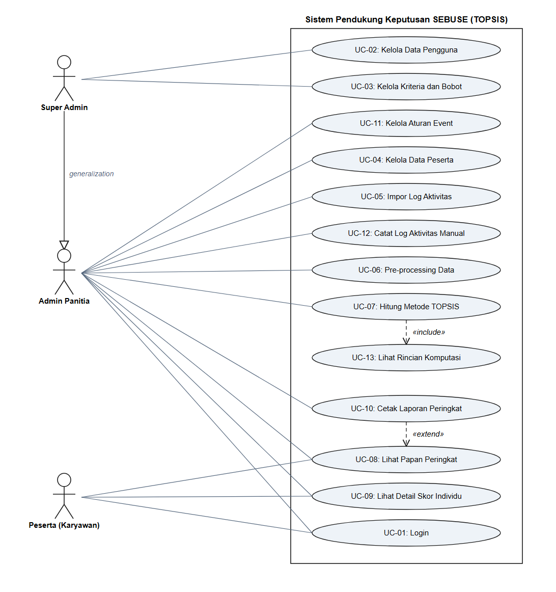

**Gambar 4. 1** Use Case Diagram Sistem Pendukung Keputusan SEBUSE

Diagram tersebut memuat tiga aktor, tiga belas use case, satu relasi
generalisasi, satu relasi `«include»`, dan satu relasi `«extend»`.

Penulis menghubungkan aktor Super Admin dengan aktor Admin Panitia melalui
relasi generalisasi. Relasi tersebut menyatakan Super Admin mewarisi seluruh
kemampuan Admin Panitia, kemudian menambahkan kemampuan pengelolaan pengguna
dan pengelolaan bobot kriteria.

Penulis menghubungkan UC-07 dengan UC-13 melalui relasi `«include»`, karena
sistem selalu menampilkan rincian komputasi setiap kali perhitungan TOPSIS
selesai dijalankan. Penulis menghubungkan UC-10 dengan UC-08 melalui relasi
`«extend»`, karena pencetakan laporan merupakan perluasan pilihan dari
penampilan papan peringkat.

**Tabel 4. 10** Matriks Aktor terhadap Use Case

| Use case | Super Admin | Admin Panitia | Peserta |
|---|---|---|---|
| UC-01 Login | ✓ | ✓ | ✓ |
| UC-02 Kelola Data Pengguna | ✓ | – | – |
| UC-03 Kelola Kriteria dan Bobot | ✓ | – | – |
| UC-04 Kelola Data Peserta | ✓ | ✓ | – |
| UC-05 Impor Log Aktivitas | ✓ | ✓ | – |
| UC-06 Pre-processing Data | ✓ | ✓ | – |
| UC-07 Hitung Metode TOPSIS | ✓ | ✓ | – |
| UC-08 Lihat Papan Peringkat | ✓ | ✓ | ✓ |
| UC-09 Lihat Detail Skor Individu | seluruh peserta | seluruh peserta | miliknya saja |
| UC-10 Cetak Laporan Peringkat | ✓ | ✓ | – |
| UC-11 Kelola Aturan Event | ✓ | ✓ | – |
| UC-12 Catat Log Aktivitas Manual | ✓ | ✓ | – |
| UC-13 Lihat Rincian Komputasi | ✓ | ✓ | – |

Sumber: Penulis (2026)

Tanda centang pada kolom Super Admin untuk UC-04 sampai UC-13 berasal dari
relasi generalisasi, bukan dari asosiasi yang digambar tersendiri.

#### a. Use Case Description Form Login (UC-01)

| | |
|---|---|
| **Use case name** | Login |
| **Scenario** | Memasukkan email dan kata sandi ke sistem untuk otentikasi hak akses |
| **Triggering Event** | Menekan tombol Login |
| **Brief Description** | Suatu use case yang berfungsi untuk memverifikasi otentikasi pengguna, yaitu Super Admin, Admin Panitia, atau Peserta, agar dapat mengakses sistem sesuai peran dan hak aksesnya. |
| **Actors** | Super Admin, Admin Panitia, Peserta |
| **Stake Holders** | Super Admin, Admin Panitia, Peserta |
| **Precondition** | Aktor belum masuk ke sistem dan berada di halaman login |
| **Post Condition** | Aktor berhasil terautentikasi, kemudian sistem mengarahkannya ke halaman dasbor utama aplikasi |

**Flows Of Activity**

| Actors | System |
|---|---|
| 1. Membuka halaman login | 1.1 Menampilkan halaman formulir login |
| 2. Memasukkan email dan kata sandi | |
| 3. Menekan tombol Login | 3.1 Memvalidasi data kredensial dengan basis data<br>3.2 Jika data valid, sistem membuat sesi pengguna dan mengarahkan ke dasbor utama<br>3.3 Jika data tidak valid, sistem menampilkan pesan kesalahan dan kembali ke halaman login |

#### b. Use Case Description Form Data Pengguna (UC-02)

| | |
|---|---|
| **Use case name** | Kelola Data Pengguna |
| **Scenario** | Melakukan tambah, ubah, dan hapus data akun pengguna sistem, yaitu Admin Panitia dan Peserta |
| **Triggering Event** | Menekan tombol Simpan, Ubah, atau Hapus data pengguna |
| **Brief Description** | Suatu use case yang berfungsi untuk mengelola master akun pengguna yang berhak mengakses aplikasi. |
| **Actors** | Super Admin |
| **Stake Holders** | Super Admin, Admin Panitia, Peserta |
| **Precondition** | Super Admin telah berhasil login dan memilih menu Data Pengguna |
| **Post Condition** | Data akun pengguna berhasil tersimpan, diperbarui, atau dihapus di dalam basis data |

**Flows Of Activity**

| Actors | System |
|---|---|
| 1. Memilih menu Data Pengguna | 1.1 Menampilkan daftar akun pengguna dan formulir kelola pengguna |
| 2. Memasukkan data pengguna, yaitu Nama, Email, Kata Sandi, dan Peran | |
| 3. Menekan tombol Simpan | 3.1 Memvalidasi kelengkapan data serta keunikan alamat email<br>3.2 Jika data valid, sistem menyimpan data ke basis data dan memperbarui daftar pengguna<br>3.3 Jika data tidak valid, sistem menampilkan notifikasi kesalahan isian<br>3.4 Jika akun yang dihapus sedang digunakan, sistem menolak penghapusan tersebut |

#### c. Use Case Description Form Kriteria dan Bobot (UC-03)

| | |
|---|---|
| **Use case name** | Kelola Kriteria dan Bobot |
| **Scenario** | Memasukkan dan memperbarui persentase bobot untuk sepuluh kriteria penilaian, yaitu C1 sampai C10 |
| **Triggering Event** | Menekan tombol Simpan Kriteria dan Bobot |
| **Brief Description** | Suatu use case yang berfungsi mengonfigurasi sepuluh kriteria penilaian beserta nilai persentase bobot yang digunakan pada perhitungan algoritma TOPSIS. |
| **Actors** | Super Admin |
| **Stake Holders** | Super Admin, Admin Panitia, Peserta |
| **Precondition** | Super Admin telah login dan mengakses halaman Kelola Kriteria dan Bobot |
| **Post Condition** | Data persentase bobot kriteria tersimpan dan siap digunakan untuk kalkulasi TOPSIS |

**Flows Of Activity**

| Actors | System |
|---|---|
| 1. Memilih menu Kriteria dan Bobot | 1.1 Menampilkan daftar sepuluh kriteria beserta jenis dan bobot yang berlaku |
| 2. Mengisi atau mengubah nilai persentase bobot kriteria | |
| 3. Menekan tombol Simpan | 3.1 Memvalidasi total akumulasi bobot, yang harus bernilai 100% atau 1,0<br>3.2 Jika total bobot valid, sistem menyimpan data ke basis data<br>3.3 Jika total bobot tidak bernilai 100%, sistem membatalkan seluruh perubahan dan menampilkan pesan peringatan agar bobot disesuaikan kembali |

#### d. Use Case Description Form Data Peserta (UC-04)

| | |
|---|---|
| **Use case name** | Kelola Data Peserta |
| **Scenario** | Melakukan tambah, ubah, dan hapus data profil peserta yang menjadi alternatif penilaian |
| **Triggering Event** | Menekan tombol Tambah atau Simpan Peserta |
| **Brief Description** | Suatu use case yang berfungsi mengelola data master profil peserta karyawan yang menjadi alternatif pada kompetisi. |
| **Actors** | Admin Panitia |
| **Stake Holders** | Admin Panitia, Peserta |
| **Precondition** | Admin Panitia telah login dan memilih menu Kelola Data Peserta |
| **Post Condition** | Data alternatif peserta berhasil tersimpan di dalam basis data |

**Flows Of Activity**

| Actors | System |
|---|---|
| 1. Memilih menu Data Peserta | 1.1 Menampilkan daftar peserta dan formulir input data peserta<br>1.2 Mengusulkan kode alternatif berikutnya secara otomatis |
| 2. Memasukkan data profil peserta, yaitu Kode Alternatif, NIP, Nama, Departemen, dan Akun Peserta | |
| 3. Menekan tombol Simpan | 3.1 Memvalidasi format dan kelengkapan data peserta<br>3.2 Jika data valid, sistem menyimpan profil peserta ke basis data<br>3.3 Jika data tidak valid, sistem meminta pengguna melengkapi isian formulir |

#### e. Use Case Description Form Impor Log Aktivitas (UC-05)

| | |
|---|---|
| **Use case name** | Impor Log Aktivitas |
| **Scenario** | Mengunggah berkas rekap log aktivitas fisik peserta dari medicalrjbb.com, Strava, atau Timestamp |
| **Triggering Event** | Menekan tombol Import Data |
| **Brief Description** | Suatu use case yang berfungsi memuat data mentah pencapaian olahraga harian seluruh peserta melalui satu berkas rekap berformat CSV, XLSX, atau XLS. Sistem mencocokkan setiap baris dengan peserta melalui kolom NIP. |
| **Actors** | Admin Panitia |
| **Stake Holders** | Admin Panitia, Peserta |
| **Precondition** | Admin Panitia telah login dan membuka menu Impor Log Aktivitas |
| **Post Condition** | Data mentah log aktivitas tersimpan di basis data sebagai satu batch dan siap di-*pre-processing* |

**Flows Of Activity**

| Actors | System |
|---|---|
| 1. Memilih menu Impor Log Aktivitas | 1.1 Menampilkan formulir unggah berkas beserta ketentuan kolom dan riwayat impor |
| 2. Memilih berkas rekap log aktivitas fisik peserta | |
| 3. Menekan tombol Import Data | 3.1 Memeriksa format berkas serta kelengkapan nama kolom wajib<br>3.2 Memvalidasi setiap baris, meliputi kesesuaian NIP, format tanggal, jenis aktivitas, dan nilai poin<br>3.3 Jika seluruh baris valid, sistem menyimpan data mentah ke basis data beserta penanda batch<br>3.4 Jika terdapat satu baris yang tidak valid, sistem membatalkan seluruh berkas dan menampilkan nomor baris beserta alasan penolakannya |
| 4. Menekan tombol Batalkan Batch apabila berkas yang diunggah keliru | 4.1 Menghapus seluruh baris dari batch tersebut tanpa mengganggu data dari unggahan lain |

#### f. Use Case Description Form Pre-processing Data (UC-06)

| | |
|---|---|
| **Use case name** | Pre-processing Data |
| **Scenario** | Mengonversi data mentah ke skala 0 sampai 100, memotong kuota poin harian yang melebihi empat poin, dan menghitung penalti *overtraining* |
| **Triggering Event** | Menekan tombol Jalankan Pre-processing |
| **Brief Description** | Suatu use case yang berfungsi mengubah data mentah menjadi Matriks Keputusan (X) berskala 0 sampai 100 sesuai aturan bisnis SEBUSE. |
| **Actors** | Admin Panitia |
| **Stake Holders** | Admin Panitia, Peserta |
| **Precondition** | Data log aktivitas mentah telah berhasil diimpor atau dicatat ke dalam sistem |
| **Post Condition** | Terbentuk Matriks Keputusan (X) bernilai skala 0 sampai 100 yang siap diproses oleh algoritma TOPSIS |

**Flows Of Activity**

| Actors | System |
|---|---|
| 1. Memilih menu Pre-processing Data | 1.1 Menampilkan aturan penilaian yang berlaku beserta ringkasan log data mentah |
| 2. Menekan tombol Jalankan Pre-processing | 2.1 Memangkas kuota poin harian yang melebihi empat poin secara proporsional<br>2.2 Memproses konversi rumus matematika sepuluh kriteria ke skala 0 sampai 100, termasuk fungsi penalti kriteria C6<br>2.3 Melewati peserta yang belum memiliki log aktivitas namun skornya sudah terisi, agar nilai yang dimasukkan langsung tidak tertimpa<br>2.4 Menyimpan hasil konversi ke Matriks Keputusan (X)<br>2.5 Menampilkan tabel pratinjau Matriks Keputusan (X) beserta catatan evaluasi setiap nilai |

#### g. Use Case Description Form Topsis (UC-07)

| | |
|---|---|
| **Use case name** | Hitung Metode TOPSIS |
| **Scenario** | Mengeksekusi kalkulasi normalisasi (R), matriks terbobot (Y), solusi ideal (A⁺ dan A⁻), jarak Euclidean (D⁺ dan D⁻), serta nilai preferensi (Vᵢ) |
| **Triggering Event** | Menekan tombol Hitung TOPSIS |
| **Brief Description** | Suatu use case yang berfungsi melakukan komputasi algoritma TOPSIS secara otomatis untuk menentukan nilai preferensi kedekatan relatif setiap peserta. |
| **Actors** | Admin Panitia |
| **Stake Holders** | Admin Panitia, Peserta |
| **Precondition** | Matriks Keputusan (X) hasil pre-processing telah terbentuk, dan akumulasi bobot kriteria bernilai tepat 100% |
| **Post Condition** | Nilai preferensi kedekatan (Vᵢ) terhitung, urutan peringkat peserta tersimpan, dan sistem menampilkan rincian komputasinya |

**Flows Of Activity**

| Actors | System |
|---|---|
| 1. Memilih menu Perhitungan TOPSIS | 1.1 Menampilkan riwayat perhitungan beserta tombol Hitung TOPSIS |
| 2. Menekan tombol Hitung TOPSIS | 2.1 Memeriksa kesiapan Matriks Keputusan dan akumulasi bobot kriteria<br>2.2 Menghitung Matriks Ternormalisasi (R), Matriks Terbobot (Y), Solusi Ideal (A⁺ dan A⁻), serta Jarak Euclidean (D⁺ dan D⁻)<br>2.3 Menghitung Nilai Preferensi (Vᵢ) dan mengurutkan peringkat<br>2.4 Menyimpan hasil beserta cuplikan seluruh matriks ke basis data<br>2.5 Menampilkan rincian komputasi sebagaimana UC-13<br>2.6 Jika prasyarat belum terpenuhi, sistem menolak perhitungan dan mengarahkan pengguna ke halaman pre-processing atau halaman kriteria |

#### h. Use Case Description Form Leaderboard (UC-08)

| | |
|---|---|
| **Use case name** | Lihat Papan Peringkat (*Leaderboard*) |
| **Scenario** | Menampilkan urutan pemenang event SEBUSE dari nilai preferensi kedekatan Vᵢ tertinggi ke terendah |
| **Triggering Event** | Menekan menu Papan Peringkat |
| **Brief Description** | Suatu use case yang menyajikan tabel papan peringkat hasil kompetisi secara transparan. |
| **Actors** | Admin Panitia, Peserta |
| **Stake Holders** | Admin Panitia, Peserta, Manajemen Perusahaan |
| **Precondition** | Perhitungan TOPSIS telah selesai dieksekusi oleh Admin Panitia |
| **Post Condition** | Pengguna dapat melihat daftar urutan juara beserta skor preferensi Vᵢ |

**Flows Of Activity**

| Actors | System |
|---|---|
| 1. Memilih menu Papan Peringkat | 1.1 Mengambil data hasil pemeringkatan terakhir dari basis data<br>1.2 Menampilkan tabel *leaderboard* terurut beserta jarak solusi ideal dan nilai preferensi Vᵢ<br>1.3 Jika pengguna berperan sebagai Peserta, sistem menyorot baris peserta tersebut dan menampilkan ringkasan peringkat pribadinya<br>1.4 Jika perhitungan belum pernah dijalankan, sistem menampilkan pemberitahuan bahwa hasil belum tersedia |

#### i. Use Case Description Form Detail Skor (UC-09)

| | |
|---|---|
| **Use case name** | Lihat Detail Skor Individu |
| **Scenario** | Menampilkan rincian pencapaian skor sepuluh kriteria, yaitu C1 sampai C10, milik seorang peserta |
| **Triggering Event** | Menekan tombol Detail Skor |
| **Brief Description** | Suatu use case yang menyajikan *breakdown* skor per kriteria. Peserta hanya dapat membuka rincian skor miliknya sendiri, sedangkan Admin Panitia dapat membuka rincian skor peserta mana pun untuk keperluan verifikasi. |
| **Actors** | Peserta, Admin Panitia |
| **Stake Holders** | Peserta, Admin Panitia |
| **Precondition** | Peserta telah login dan membuka halaman Papan Peringkat atau Dasbor |
| **Post Condition** | Sistem menampilkan halaman rincian skor per kriteria milik peserta yang bersangkutan |

**Flows Of Activity**

| Actors | System |
|---|---|
| 1. Menekan tombol Lihat Detail Skor | 1.1 Memeriksa hak akses pengguna atas data peserta yang diminta<br>1.2 Mengambil data pencapaian sepuluh kriteria milik peserta<br>1.3 Menampilkan *breakdown* skor C1 sampai C10 beserta bobot dan catatan evaluasi<br>1.4 Menampilkan peringkat, nilai preferensi, dan jarak terhadap kedua solusi ideal<br>1.5 Jika Peserta membuka rincian skor peserta lain, sistem menolak permintaan tersebut |

#### j. Use Case Description Form Cetak Laporan (UC-10)

| | |
|---|---|
| **Use case name** | Cetak Laporan Peringkat |
| **Scenario** | Mencetak atau mengunduh dokumen laporan resmi hasil pemeringkatan ke format PDF atau Excel |
| **Triggering Event** | Menekan tombol Cetak PDF atau Export Excel |
| **Brief Description** | Suatu use case yang berfungsi merekap hasil akhir pemeringkatan SEBUSE ke dalam berkas cetak atau unduhan resmi. |
| **Actors** | Admin Panitia |
| **Stake Holders** | Admin Panitia, Manajemen Perusahaan |
| **Precondition** | Admin Panitia berada pada halaman Papan Peringkat yang memiliki data hasil TOPSIS |
| **Post Condition** | Berkas laporan resmi pemeringkatan terunduh dalam format PDF atau Excel |

**Flows Of Activity**

| Actors | System |
|---|---|
| 1. Memilih tombol Cetak Laporan | 1.1 Menyiapkan format tata letak dokumen laporan |
| 2. Memilih format unduhan, yaitu PDF atau Excel | 2.1 Mengambil data pemeringkatan beserta cuplikan bobot yang dipakai saat perhitungan<br>2.2 Mengonversi data pemeringkatan ke dalam berkas dokumen<br>2.3 Mengunduh berkas laporan secara otomatis ke perangkat pengguna |

#### k. Use Case Description Form Aturan Event (UC-11)

| | |
|---|---|
| **Use case name** | Kelola Aturan Event |
| **Scenario** | Mengubah parameter regulasi penilaian yang digunakan oleh mesin pre-processing |
| **Triggering Event** | Menekan tombol Simpan Aturan |
| **Brief Description** | Suatu use case yang berfungsi menyesuaikan dua belas parameter regulasi event, meliputi target poin bulanan, kuota poin harian, syarat mingguan, batas hari olahraga beruntun, dan besar penalti, tanpa mengubah kode program. |
| **Actors** | Admin Panitia |
| **Stake Holders** | Admin Panitia, Peserta, Manajemen Perusahaan |
| **Precondition** | Admin Panitia telah login dan membuka halaman Event |
| **Post Condition** | Parameter regulasi tersimpan dan langsung digunakan pada pre-processing berikutnya |

**Flows Of Activity**

| Actors | System |
|---|---|
| 1. Memilih menu Event, kemudian menekan tombol Ubah Aturan | 1.1 Menampilkan formulir parameter regulasi beserta nilai yang berlaku |
| 2. Mengubah nilai parameter yang diperlukan | |
| 3. Menekan tombol Simpan Aturan | 3.1 Memvalidasi setiap parameter agar bernilai lebih besar dari nol<br>3.2 Jika data valid, sistem menyimpan parameter dan menampilkan halaman event<br>3.3 Jika data tidak valid, sistem menampilkan pesan kesalahan pada formulir |

#### l. Use Case Description Form Catat Log Manual (UC-12)

| | |
|---|---|
| **Use case name** | Catat Log Aktivitas Manual |
| **Scenario** | Mencatat satu baris log aktivitas fisik peserta melalui formulir |
| **Triggering Event** | Menekan tombol Simpan Log |
| **Brief Description** | Suatu use case yang berfungsi mencatat log aktivitas satu per satu. Use case ini digunakan untuk penyesuaian data atau untuk peserta yang datanya tidak tercakup pada berkas rekap. |
| **Actors** | Admin Panitia |
| **Stake Holders** | Admin Panitia, Peserta |
| **Precondition** | Admin Panitia telah login dan membuka daftar log aktivitas seorang peserta |
| **Post Condition** | Satu baris log aktivitas tersimpan beserta penanda sumber manual |

**Flows Of Activity**

| Actors | System |
|---|---|
| 1. Menekan tombol Catat Aktivitas | 1.1 Menampilkan formulir log aktivitas |
| 2. Mengisi tanggal, jenis aktivitas, poin, jarak, dan tautan bukti | |
| 3. Menekan tombol Simpan Log | 3.1 Memvalidasi kelengkapan dan kewajaran nilai yang diisikan<br>3.2 Jika data valid, sistem menyimpan log beserta penanda sumber manual<br>3.3 Jika data tidak valid, sistem menampilkan pesan kesalahan<br>3.4 Menandai hari yang total poinnya melampaui kuota empat poin pada daftar log |

#### m. Use Case Description Form Rincian Komputasi (UC-13)

| | |
|---|---|
| **Use case name** | Lihat Rincian Komputasi |
| **Scenario** | Menampilkan keenam tahapan perhitungan TOPSIS beserta rumus yang digunakan |
| **Triggering Event** | Selesainya perhitungan TOPSIS, atau menekan tautan Rincian Komputasi pada riwayat perhitungan |
| **Brief Description** | Suatu use case yang berfungsi menyajikan Matriks Keputusan (X), Matriks Ternormalisasi (R), Matriks Terbobot (Y), Solusi Ideal (A⁺ dan A⁻), Jarak Euclidean (D⁺ dan D⁻), serta Nilai Preferensi (Vᵢ) dari cuplikan yang tersimpan pada saat perhitungan dijalankan. |
| **Actors** | Admin Panitia |
| **Stake Holders** | Admin Panitia, Peserta, Manajemen Perusahaan |
| **Precondition** | Perhitungan TOPSIS telah dijalankan sekurang-kurangnya satu kali |
| **Post Condition** | Seluruh tahapan perhitungan tersaji beserta bobot yang digunakan saat eksekusi |

**Flows Of Activity**

| Actors | System |
|---|---|
| 1. Menyelesaikan UC-07, atau memilih satu baris pada riwayat perhitungan | 1.1 Mengambil cuplikan perhitungan dari tabel `topsis_runs`<br>1.2 Menampilkan Matriks Keputusan (X), Matriks Ternormalisasi (R), dan Matriks Terbobot (Y) secara berurutan<br>1.3 Menampilkan Solusi Ideal Positif dan Negatif<br>1.4 Menampilkan Jarak Euclidean, Nilai Preferensi, dan peringkat setiap peserta<br>1.5 Menampilkan bobot kriteria yang digunakan pada saat perhitungan dijalankan |

### 2. Activity Diagram

Activity diagram menggambarkan alir kerja setiap use case dari sisi aktor
maupun sisi sistem. Penulis menyajikan activity diagram untuk UC-01 sampai
UC-10, sedangkan UC-11 sampai UC-13 merupakan fungsi pendukung yang telah
diuraikan melalui deskripsi use case.

#### a. Activity Diagram Form Login (UC-01)

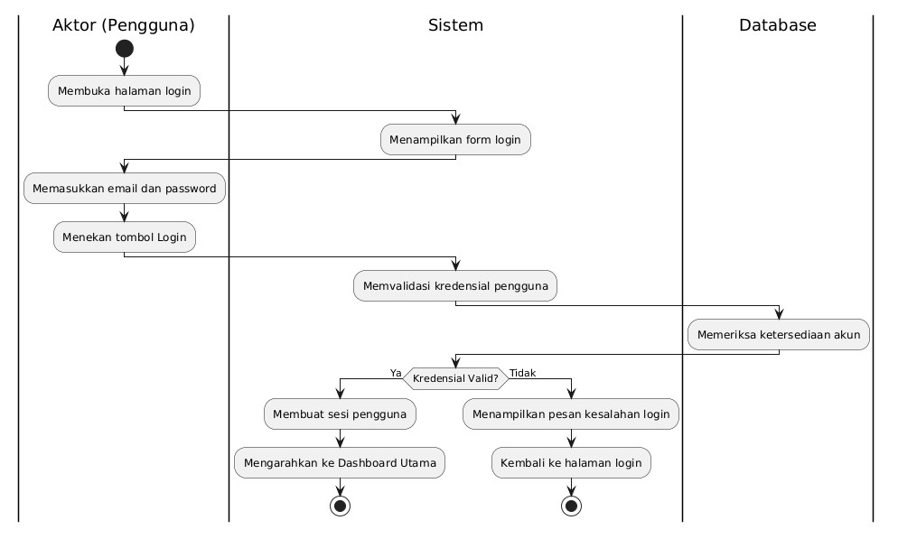

**Gambar 4. 2** Activity Diagram Login (UC-01)

Diagram tersebut menggambarkan alur otentikasi pengguna, yaitu Super Admin,
Admin Panitia, dan Peserta. Sistem memvalidasi email dan kata sandi ke basis
data sebelum pengguna masuk ke dasbor.

#### b. Activity Diagram Form Data Pengguna (UC-02)

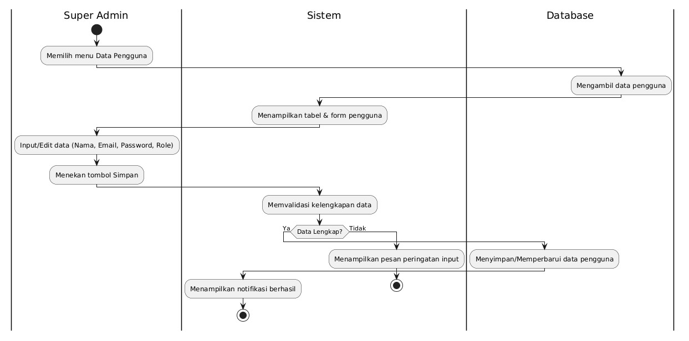

**Gambar 4. 3** Activity Diagram Kelola Data Pengguna (UC-02)

Diagram tersebut mengalirkan proses Super Admin dalam mengelola data akun
pengguna, yaitu menambah, mengubah, dan menghapus, beserta penetapan peran dan
hak aksesnya.

#### c. Activity Diagram Form Kriteria dan Bobot (UC-03)

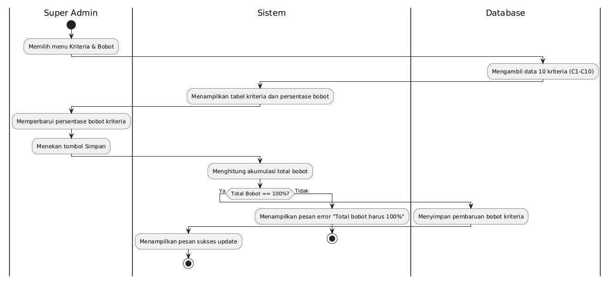

**Gambar 4. 4** Activity Diagram Kelola Kriteria dan Bobot (UC-03)

Diagram tersebut mengatur alur pembaruan bobot sepuluh kriteria oleh Super
Admin. Sistem memeriksa agar total akumulasi bobot bernilai tepat 100% sebelum
menyimpan perubahan.

#### d. Activity Diagram Form Data Peserta (UC-04)

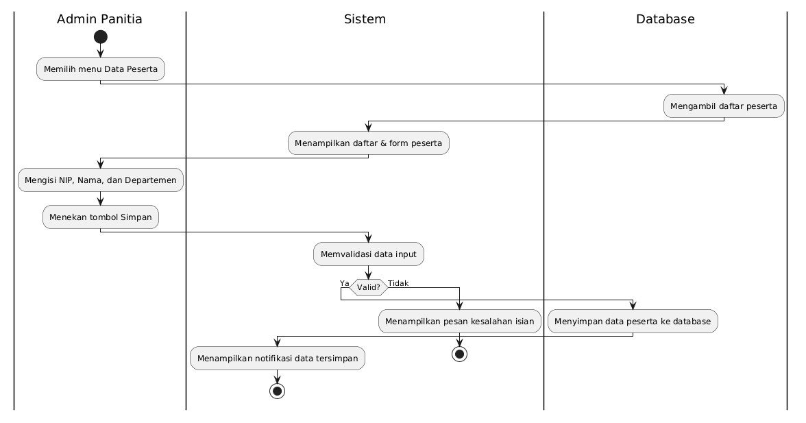

**Gambar 4. 5** Activity Diagram Kelola Data Peserta (UC-04)

Diagram tersebut mengalirkan alur Admin Panitia dalam mencatat profil karyawan
peserta event SEBUSE yang bertindak sebagai alternatif penilaian.

#### e. Activity Diagram Form Impor Log Aktivitas (UC-05)

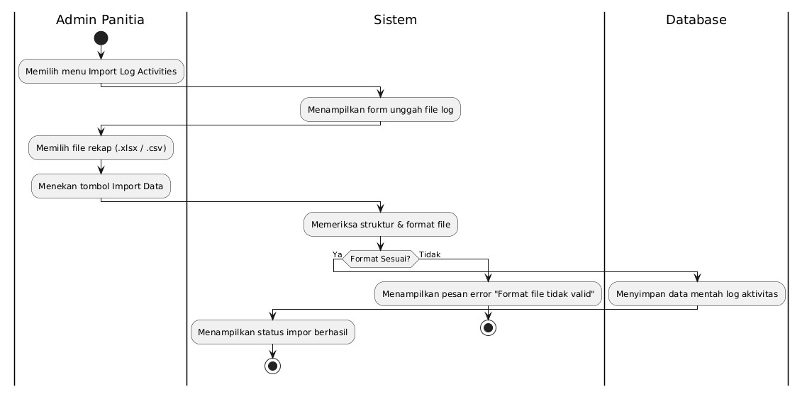

**Gambar 4. 6** Activity Diagram Impor Log Aktivitas (UC-05)

Diagram tersebut menjelaskan alur Admin Panitia saat mengunggah berkas data
mentah pencapaian aktivitas fisik peserta dari platform eksternal.

#### f. Activity Diagram Form Pre-processing Data (UC-06)

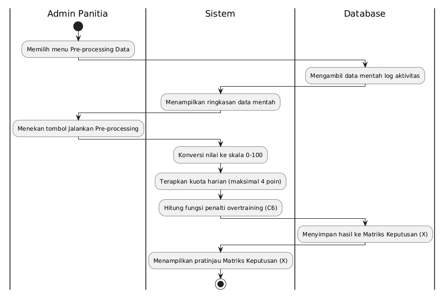

**Gambar 4. 7** Activity Diagram Pre-processing Data (UC-06)

Diagram tersebut menggambarkan otomasi sistem dalam mengonversi log mentah ke
skala 0 sampai 100, memangkas kuota harian sebanyak empat poin, serta menghitung
penalti *overtraining* pada kriteria C6.

#### g. Activity Diagram Form Topsis (UC-07)

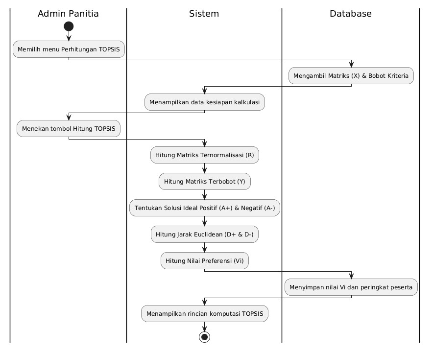

**Gambar 4. 8** Activity Diagram Hitung Metode TOPSIS (UC-07)

Diagram tersebut menjelaskan alur eksekusi komputasi matematis TOPSIS, dimulai
dari pembentukan matriks R dan Y, penentuan solusi ideal A⁺ dan A⁻, hingga
diperolehnya nilai preferensi Vᵢ.

#### h. Activity Diagram Form Papan Peringkat (UC-08)

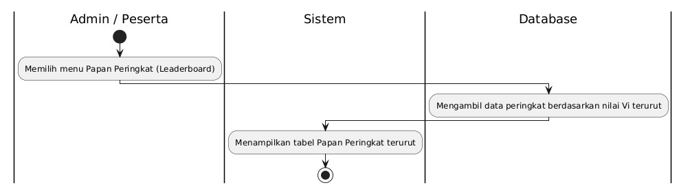

**Gambar 4. 9** Activity Diagram Lihat Papan Peringkat (UC-08)

Diagram tersebut mengalirkan proses sistem dalam memuat dan menampilkan papan
peringkat peserta yang sudah terurut otomatis berdasarkan nilai Vᵢ terbesar.

#### i. Activity Diagram Form Detail Skor (UC-09)

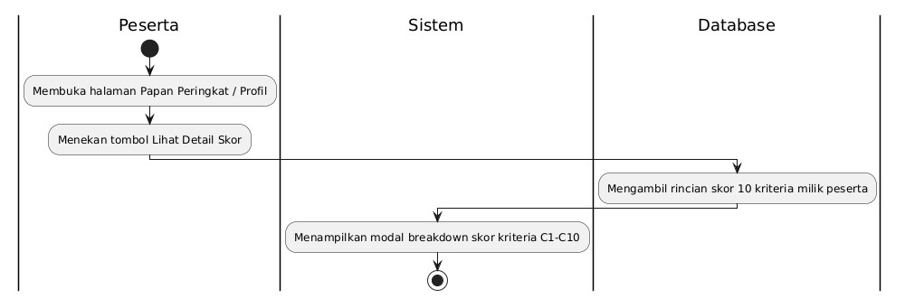

**Gambar 4. 10** Activity Diagram Lihat Detail Skor Individu (UC-09)

Diagram tersebut menggambarkan alur Peserta saat mengakses *breakdown* pencapaian
skor personal secara rinci untuk kriteria C1 hingga C10.

#### j. Activity Diagram Form Cetak Laporan (UC-10)

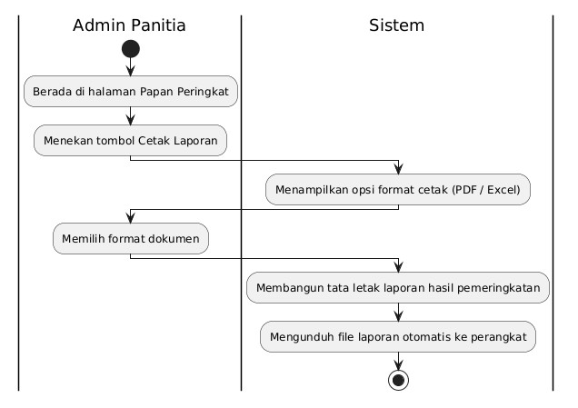

**Gambar 4. 11** Activity Diagram Cetak Laporan Peringkat (UC-10)

Diagram tersebut menjelaskan alur Admin Panitia dalam mengekspor rekapitulasi
data pemeringkatan akhir ke dalam format dokumen resmi PDF atau Excel.

### 3. Sequence Diagram

Sequence diagram menggambarkan urutan pesan antar objek pada setiap use case.
Penulis menyajikan sequence diagram untuk UC-01 sampai UC-10.

#### a. Sequence Diagram Form Login (UC-01)

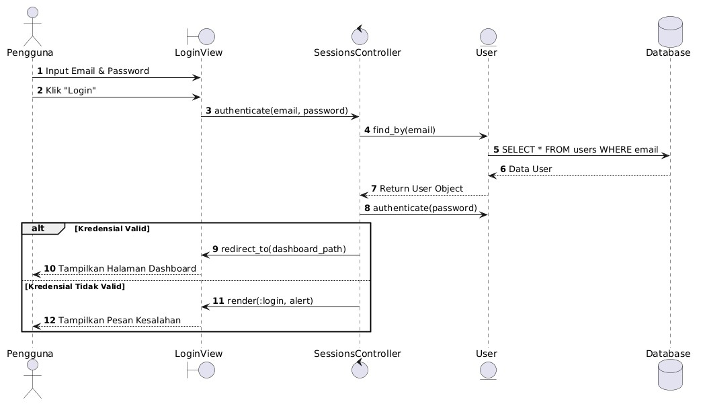

**Gambar 4. 12** Sequence Diagram Login (UC-01)

Diagram tersebut menggambarkan alur interaksi otentikasi hak akses pengguna.
`SessionsController` meminta model `User` memverifikasi kredensial ke basis data.
Jika data valid, sistem membuat sesi dan mengarahkan pengguna ke dasbor. Jika
gagal, sistem mengembalikan pesan kesalahan.

#### b. Sequence Diagram Form Data Pengguna (UC-02)

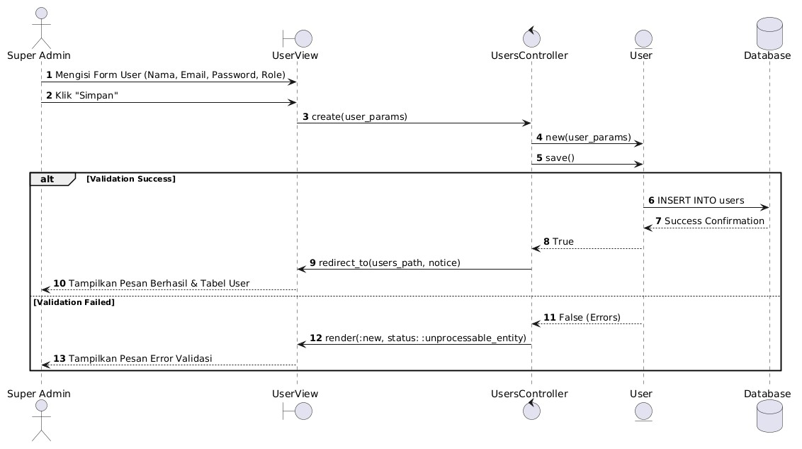

**Gambar 4. 13** Sequence Diagram Kelola Data Pengguna (UC-02)

Diagram tersebut menjelaskan proses pengelolaan akun oleh Super Admin. Data
input dari antarmuka dikirim melalui `UsersController` untuk divalidasi oleh
model `User` sebelum disimpan ke tabel `users`.

#### c. Sequence Diagram Form Kriteria dan Bobot (UC-03)

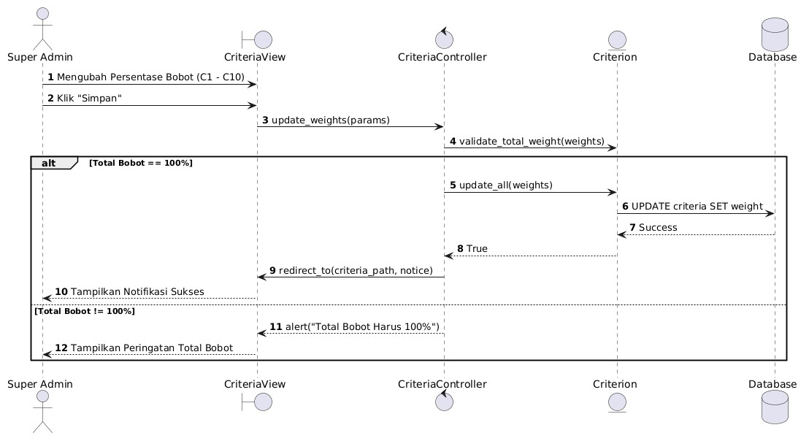

**Gambar 4. 14** Sequence Diagram Kelola Kriteria dan Bobot (UC-03)

Diagram tersebut mengatur interaksi pembaruan nilai bobot sepuluh kriteria.
`CriteriaController` memanggil metode validasi pada model `Criterion` untuk
memastikan total seluruh bobot bernilai tepat 100% sebelum disimpan.

#### d. Sequence Diagram Form Data Peserta (UC-04)

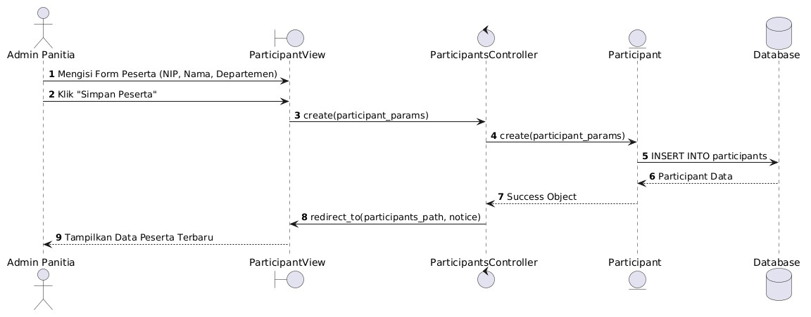

**Gambar 4. 15** Sequence Diagram Kelola Data Peserta (UC-04)

Diagram tersebut menjelaskan proses pencatatan profil peserta.
`ParticipantsController` menerima data dari antarmuka, meminta model
`Participant` memvalidasinya, kemudian menyimpannya ke tabel `participants`.

#### e. Sequence Diagram Form Impor Log Aktivitas (UC-05)

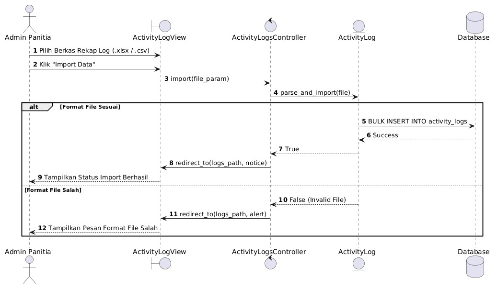

**Gambar 4. 16** Sequence Diagram Impor Log Aktivitas (UC-05)

Diagram tersebut menjelaskan proses pengunggahan berkas log aktivitas fisik.
Pengendali menerima berkas, memparsing datanya, lalu mengeksekusi operasi
*bulk insert* ke basis data. Apabila format berkas tidak sesuai, sistem
mengembalikan pesan galat tanpa menyimpan satu baris pun.

#### f. Sequence Diagram Form Pre-processing Data (UC-06)

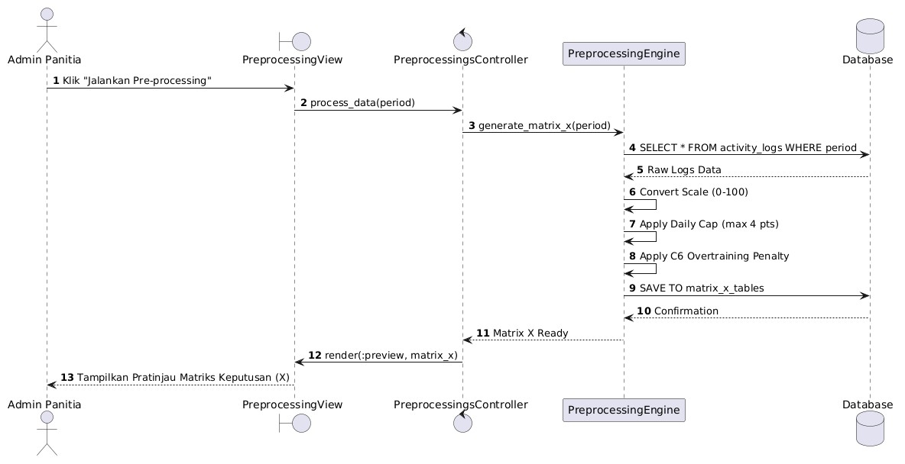

**Gambar 4. 17** Sequence Diagram Pre-processing Data (UC-06)

Diagram tersebut menggambarkan otomasi *service object* `PreprocessingEngine`.
Objek tersebut mengambil data log mentah dari basis data, melakukan konversi
skala 0 sampai 100, pemangkasan kuota harian, dan perhitungan penalti C6, hingga
terbentuk Matriks Keputusan (X).

#### g. Sequence Diagram Form Topsis (UC-07)

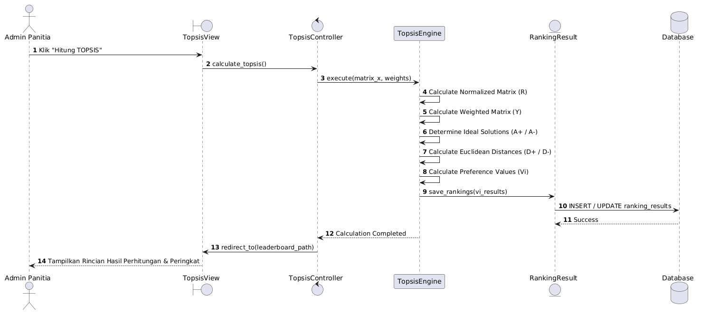

**Gambar 4. 18** Sequence Diagram Hitung Metode TOPSIS (UC-07)

Diagram tersebut menunjukkan alur kalkulasi metode TOPSIS oleh `TopsisEngine`.
Objek tersebut memproses Matriks X dan bobot kriteria untuk menghasilkan matriks
R, matriks Y, solusi ideal A⁺ dan A⁻, jarak D⁺ dan D⁻, serta preferensi Vᵢ yang
disimpan ke tabel `ranking_results`.

#### h. Sequence Diagram Form Leaderboard (UC-08)

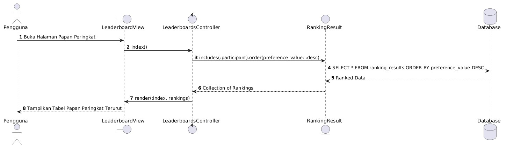

**Gambar 4. 19** Sequence Diagram Lihat Papan Peringkat (UC-08)

Diagram tersebut menjelaskan proses penarikan data papan peringkat.
`LeaderboardsController` meminta model `RankingResult` mengambil data hasil
kalkulasi yang sudah terurut berdasarkan nilai preferensi Vᵢ tertinggi.

#### i. Sequence Diagram Form Detail Skor (UC-09)

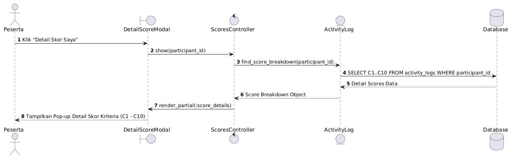

**Gambar 4. 20** Sequence Diagram Lihat Detail Skor Individu (UC-09)

Diagram tersebut menggambarkan alur akses evaluasi mandiri oleh Peserta.
`ScoresController` mengambil rincian penilaian kriteria C1 sampai C10 milik
peserta yang bersangkutan, kemudian mengembalikannya ke tampilan rincian skor.

#### j. Sequence Diagram Form Cetak Laporan (UC-10)

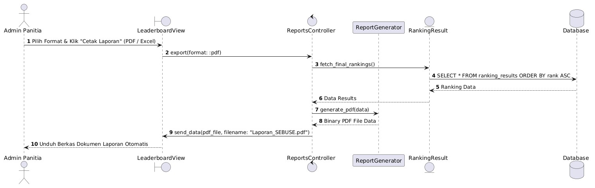

**Gambar 4. 21** Sequence Diagram Cetak Laporan Peringkat (UC-10)

Diagram tersebut mengalirkan alur pembuatan rekapitulasi laporan resmi
pemeringkatan. `ReportsController` mengambil data peringkat dari model
`RankingResult`, mengirimkannya ke modul `ReportGenerator` untuk diformat, lalu
mengunduh berkas dokumen PDF atau Excel ke perangkat pengguna.

### 4. Class Diagram dan Entity Relationship Diagram

Penulis menurunkan rancangan struktur data dari sequence diagram pada bagian
C.3 dan dari rumus pra-pemrosesan pada bagian B.2, kemudian mewujudkannya
menjadi sembilan tabel pada basis data PostgreSQL.

#### a. Entity Relationship Diagram

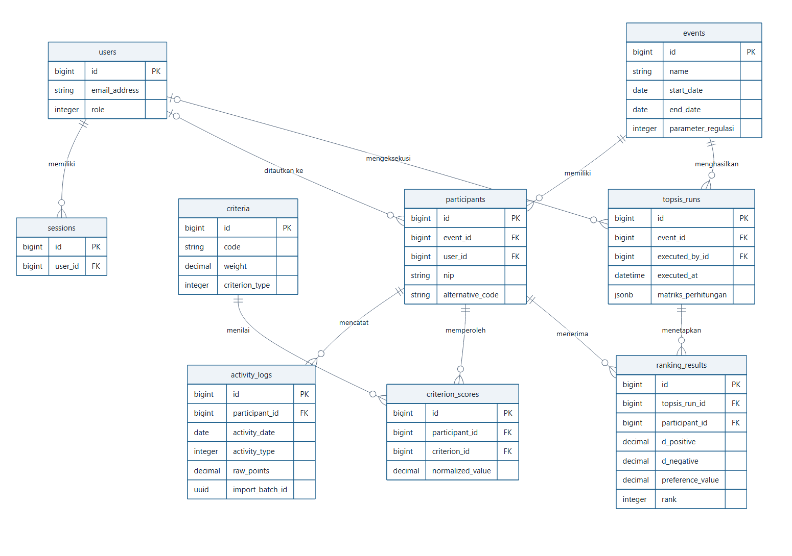

**Gambar 4. 22** Entity Relationship Diagram Sistem Pendukung Keputusan SEBUSE

Diagram tersebut menampilkan kunci utama, kunci tamu, dan atribut pembeda setiap
entitas. Daftar kolom selengkapnya dimuat pada subbagian c Spesifikasi Tabel.

Tabel berikut memuat relasi antar entitas beserta kardinalitasnya.

| Relasi | Kardinalitas | Keterangan |
|---|---|---|
| `users` — `sessions` | satu ke banyak | Satu pengguna dapat memiliki beberapa sesi masuk |
| `users` — `participants` | nol atau satu ke banyak | Akun peserta ditautkan ke data peserta agar dapat membuka rincian skornya |
| `users` — `topsis_runs` | nol atau satu ke banyak | Mencatat pengguna yang mengeksekusi perhitungan |
| `events` — `participants` | satu ke banyak | Satu event memiliki banyak peserta sebagai alternatif |
| `events` — `topsis_runs` | satu ke banyak | Satu event dapat dihitung berulang kali |
| `participants` — `activity_logs` | satu ke banyak | Satu peserta mencatat banyak baris log aktivitas |
| `participants` — `criterion_scores` | satu ke banyak | Satu peserta memperoleh sepuluh nilai kriteria |
| `criteria` — `criterion_scores` | satu ke banyak | Satu kriteria menilai seluruh peserta |
| `topsis_runs` — `ranking_results` | satu ke banyak | Satu perhitungan menetapkan peringkat seluruh peserta |
| `participants` — `ranking_results` | satu ke banyak | Satu peserta menerima satu hasil pada setiap perhitungan |

Seluruh tabel telah memenuhi bentuk normal ketiga. Setiap kolom bernilai atomik
dan tidak memuat kelompok berulang, setiap kolom bukan kunci bergantung penuh
pada kunci utama, serta tidak terdapat ketergantungan transitif. Nama dan bobot
kriteria disimpan sekali pada tabel `criteria` dan tidak diulang pada tabel
`criterion_scores`.

#### b. Class Diagram

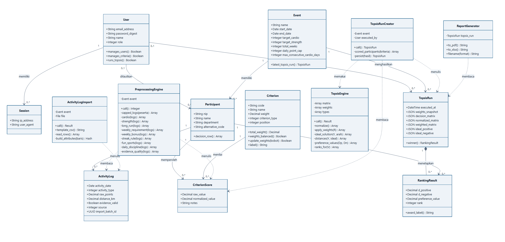

**Gambar 4. 23** Class Diagram Sistem Pendukung Keputusan SEBUSE

Diagram tersebut memuat sembilan kelas model yang mewakili tabel basis data,
serta lima kelas layanan (*service object*) yang menampung logika perhitungan.

Kelas layanan tersebut adalah `ActivityLogImport` yang membaca berkas rekap,
`PreprocessingEngine` yang membentuk matriks keputusan, `TopsisEngine` yang
melaksanakan keenam tahapan TOPSIS, `TopsisRunCreator` yang menjembatani basis
data dengan mesin perhitungan, serta `ReportGenerator` yang menyusun laporan.

Penulis memisahkan `TopsisEngine` dari lapisan penyimpanan data. Masukan kelas
tersebut berupa larik angka dan keluarannya berupa objek hasil, sehingga
kebenaran matematikanya dapat diuji langsung terhadap matriks keputusan pada
Tabel 4.3 tanpa membuat satu pun data pada basis data.

#### c. Spesifikasi Tabel

Tipe data mengikuti PostgreSQL. Kolom `id` pada seluruh tabel merupakan kunci
utama bertipe `bigint` yang bertambah otomatis, sedangkan kolom `created_at` dan
`updated_at` bertipe `timestamp` dan tercatat otomatis oleh kerangka kerja.

**Tabel 4. 11** Spesifikasi Tabel `users`

| No. | Nama kolom | Tipe | Batasan | Keterangan |
|---|---|---|---|---|
| 1 | `id` | bigint | PK | Pengenal unik pengguna |
| 2 | `email_address` | varchar | NOT NULL, unik | Alamat email untuk masuk sistem |
| 3 | `password_digest` | varchar | NOT NULL | Kata sandi dalam bentuk sidik bcrypt |
| 4 | `name` | varchar | NOT NULL | Nama lengkap pengguna |
| 5 | `role` | integer | NOT NULL | 0 Super Admin, 1 Admin Panitia, 2 Peserta |

**Tabel 4. 12** Spesifikasi Tabel `sessions`

| No. | Nama kolom | Tipe | Batasan | Keterangan |
|---|---|---|---|---|
| 1 | `id` | bigint | PK | Pengenal unik sesi |
| 2 | `user_id` | bigint | FK ke `users`, NOT NULL | Pemilik sesi |
| 3 | `ip_address` | varchar | boleh kosong | Alamat IP saat masuk |
| 4 | `user_agent` | varchar | boleh kosong | Keterangan peramban yang dipakai |

**Tabel 4. 13** Spesifikasi Tabel `events`

| No. | Nama kolom | Tipe | Batasan | Keterangan |
|---|---|---|---|---|
| 1 | `id` | bigint | PK | Pengenal unik event |
| 2 | `name` | varchar | NOT NULL | Nama event |
| 3 | `start_date` | date | NOT NULL | Tanggal mulai, acuan minggu ke-1 |
| 4 | `end_date` | date | NOT NULL | Tanggal berakhir |
| 5 | `target_cardio` | integer | NOT NULL, default 24 | Target poin cardio sebulan (C1) |
| 6 | `target_strength` | integer | NOT NULL, default 16 | Target poin strength sebulan (C2) |
| 7 | `total_weeks` | integer | NOT NULL, default 4 | Jumlah minggu program (C4 dan C5) |
| 8 | `daily_point_cap` | integer | NOT NULL, default 4 | Kuota poin maksimal per hari (C9) |
| 9 | `streak_penalty_per_violation` | integer | NOT NULL, default 25 | Penalti per rentetan pelanggaran (C6) |
| 10 | `long_run_target_km` | decimal(6,2) | NOT NULL, default 10 | Jarak wajib Long Run (C3) |
| 11 | `weekly_cardio_target` | integer | NOT NULL, default 2 | Syarat cardio per minggu (C4) |
| 12 | `weekly_strength_target` | integer | NOT NULL, default 1 | Syarat strength per minggu (C4) |
| 13 | `bonus_cardio_target` | integer | NOT NULL, default 3 | Syarat cardio untuk bonus (C5) |
| 14 | `bonus_strength_target` | integer | NOT NULL, default 2 | Syarat strength untuk bonus (C5) |
| 15 | `max_consecutive_cardio_days` | integer | NOT NULL, default 3 | Batas hari cardio berturut-turut (C6) |
| 16 | `fun_sport_point_target` | integer | NOT NULL, default 4 | Kuota poin fun sports sebulan (C8) |

**Tabel 4. 14** Spesifikasi Tabel `criteria`

| No. | Nama kolom | Tipe | Batasan | Keterangan |
|---|---|---|---|---|
| 1 | `id` | bigint | PK | Pengenal unik kriteria |
| 2 | `code` | varchar | NOT NULL, unik | Kode kriteria C1 sampai C10 |
| 3 | `name` | varchar | NOT NULL | Nama kriteria penilaian |
| 4 | `weight` | decimal(5,4) | NOT NULL | Bobot desimal, akumulasi seluruhnya 1,0 |
| 5 | `criterion_type` | integer | NOT NULL | 0 benefit, 1 cost |
| 6 | `position` | integer | NOT NULL, unik | Urutan tampil C1 sampai C10 |

**Tabel 4. 15** Spesifikasi Tabel `participants`

| No. | Nama kolom | Tipe | Batasan | Keterangan |
|---|---|---|---|---|
| 1 | `id` | bigint | PK | Pengenal unik peserta |
| 2 | `event_id` | bigint | FK ke `events`, NOT NULL | Event yang diikuti |
| 3 | `user_id` | bigint | FK ke `users`, boleh kosong | Akun peserta |
| 4 | `nip` | varchar | NOT NULL, unik per event | Nomor induk pegawai, kunci pencocokan impor |
| 5 | `name` | varchar | NOT NULL | Nama peserta |
| 6 | `department` | varchar | boleh kosong | Departemen peserta |
| 7 | `alternative_code` | varchar | NOT NULL, unik per event | Kode alternatif A1 sampai An |

**Tabel 4. 16** Spesifikasi Tabel `activity_logs`

| No. | Nama kolom | Tipe | Batasan | Keterangan |
|---|---|---|---|---|
| 1 | `id` | bigint | PK | Pengenal unik log |
| 2 | `participant_id` | bigint | FK ke `participants`, NOT NULL | Peserta pemilik log |
| 3 | `activity_date` | date | NOT NULL | Tanggal pelaksanaan aktivitas |
| 4 | `activity_type` | integer | NOT NULL | 0 cardio, 1 strength, 2 long run, 3 fun sport |
| 5 | `raw_points` | decimal(6,2) | NOT NULL | Poin sebelum pemangkasan kuota harian |
| 6 | `distance_km` | decimal(6,2) | boleh kosong | Jarak tempuh, wajib untuk Long Run |
| 7 | `evidence_url` | varchar | boleh kosong | Tautan bukti Strava atau foto Timestamp |
| 8 | `evidence_valid` | boolean | NOT NULL | Penilaian panitia atas keabsahan bukti (C10) |
| 9 | `source` | integer | NOT NULL | 0 input manual, 1 hasil impor berkas |
| 10 | `import_batch_id` | uuid | boleh kosong | Penanda batch unggahan |

**Tabel 4. 17** Spesifikasi Tabel `criterion_scores`

| No. | Nama kolom | Tipe | Batasan | Keterangan |
|---|---|---|---|---|
| 1 | `id` | bigint | PK | Pengenal unik skor |
| 2 | `participant_id` | bigint | FK ke `participants`, NOT NULL | Peserta yang dinilai |
| 3 | `criterion_id` | bigint | FK ke `criteria`, NOT NULL | Kriteria penilaian |
| 4 | `raw_value` | decimal(10,2) | boleh kosong | Nilai mentah sebelum konversi |
| 5 | `normalized_value` | decimal(8,4) | NOT NULL | Nilai hasil konversi pada skala 0–100 |
| 6 | `notes` | varchar | boleh kosong | Catatan evaluasi untuk UC-09 |

**Tabel 4. 18** Spesifikasi Tabel `topsis_runs`

| No. | Nama kolom | Tipe | Batasan | Keterangan |
|---|---|---|---|---|
| 1 | `id` | bigint | PK | Pengenal unik perhitungan |
| 2 | `event_id` | bigint | FK ke `events`, NOT NULL | Event yang dihitung |
| 3 | `executed_by_id` | bigint | FK ke `users`, boleh kosong | Pengguna yang mengeksekusi |
| 4 | `executed_at` | timestamp | NOT NULL | Waktu eksekusi perhitungan |
| 5 | `weights_snapshot` | jsonb | NOT NULL | Bobot kriteria saat eksekusi |
| 6 | `decision_matrix` | jsonb | NOT NULL | Matriks Keputusan (X) |
| 7 | `normalized_matrix` | jsonb | NOT NULL | Matriks Ternormalisasi (R) |
| 8 | `weighted_matrix` | jsonb | NOT NULL | Matriks Terbobot (Y) |
| 9 | `ideal_positive` | jsonb | NOT NULL | Solusi Ideal Positif (A⁺) |
| 10 | `ideal_negative` | jsonb | NOT NULL | Solusi Ideal Negatif (A⁻) |

**Tabel 4. 19** Spesifikasi Tabel `ranking_results`

| No. | Nama kolom | Tipe | Batasan | Keterangan |
|---|---|---|---|---|
| 1 | `id` | bigint | PK | Pengenal unik hasil |
| 2 | `topsis_run_id` | bigint | FK ke `topsis_runs`, NOT NULL | Perhitungan yang menghasilkan peringkat |
| 3 | `participant_id` | bigint | FK ke `participants`, NOT NULL | Peserta yang diperingkatkan |
| 4 | `d_positive` | decimal(12,8) | NOT NULL | Jarak terhadap solusi ideal positif |
| 5 | `d_negative` | decimal(12,8) | NOT NULL | Jarak terhadap solusi ideal negatif |
| 6 | `preference_value` | decimal(8,4) | NOT NULL | Nilai preferensi Vᵢ pada rentang 0–1 |
| 7 | `rank` | integer | NOT NULL | Peringkat akhir |

### 5. Implementasi Antarmuka

Penulis mengimplementasikan seluruh rancangan tersebut menjadi purwarupa
aplikasi berbasis web. Tangkapan layar berikut diambil dari aplikasi yang
berjalan dengan data simulasi lima peserta pada Tabel 4.3.

#### a. Halaman Login


**Gambar 4. 24** Tampilan Halaman Login (UC-01)

#### b. Halaman Dasbor


**Gambar 4. 25** Tampilan Dasbor Admin Panitia

#### c. Halaman Kelola Data Pengguna


**Gambar 4. 26** Tampilan Kelola Data Pengguna (UC-02)

#### d. Halaman Kelola Kriteria dan Bobot


**Gambar 4. 27** Tampilan Kelola Kriteria dan Bobot (UC-03)

#### e. Halaman Kelola Data Peserta


**Gambar 4. 28** Tampilan Kelola Data Peserta (UC-04)

#### f. Halaman Impor Log Aktivitas


**Gambar 4. 29** Tampilan Impor Log Aktivitas (UC-05)

#### g. Halaman Log Aktivitas Peserta


**Gambar 4. 30** Tampilan Pencatatan Log Aktivitas Peserta (UC-12)

#### h. Halaman Pre-processing Data


**Gambar 4. 31** Tampilan Pre-processing Data dan Matriks Keputusan (UC-06)

#### i. Halaman Riwayat Perhitungan TOPSIS


**Gambar 4. 32** Tampilan Riwayat Perhitungan TOPSIS (UC-07)

#### j. Halaman Rincian Komputasi TOPSIS


**Gambar 4. 33** Tampilan Rincian Komputasi Metode TOPSIS (UC-13)

Halaman tersebut menampilkan keenam tahapan perhitungan secara berurutan, dan
angkanya sama dengan perhitungan manual pada bagian B.3.

#### k. Halaman Papan Peringkat


**Gambar 4. 34** Tampilan Papan Peringkat (UC-08)

#### l. Halaman Papan Peringkat pada Akun Peserta


**Gambar 4. 35** Tampilan Papan Peringkat pada Akun Peserta (UC-08)

#### m. Halaman Detail Skor Individu


**Gambar 4. 36** Tampilan Detail Skor Individu (UC-09)

#### n. Keluaran Laporan Pemeringkatan


**Gambar 4. 37** Keluaran Laporan Pemeringkatan Berformat PDF (UC-10)

---

## D. Kelebihan dan Kelemahan Penelitian

Bagian ini menguraikan keunggulan yang dicapai serta keterbatasan yang masih
melekat pada purwarupa Sistem Pendukung Keputusan yang dibangun. Penulis
menyajikan uraian keterbatasan secara terbuka agar penelitian lanjutan memiliki
pijakan yang jelas.

### 1. Kelebihan Penelitian

**a. Kebenaran komputasi terverifikasi terhadap perhitungan manual**

Penulis menguji mesin perhitungan sistem secara otomatis terhadap hasil
perhitungan manual pada bagian B.3. Pengujian membandingkan sepuluh pembagi
normalisasi, matriks ternormalisasi (R), solusi ideal positif dan negatif,
jarak Euclidean, serta nilai preferensi hingga empat angka desimal. Kesesuaian
hasil sistem terhadap perhitungan manual karena itu bukan berupa pernyataan,
melainkan keadaan yang diperiksa ulang setiap kali program dijalankan.

**b. Transparansi seluruh tahapan perhitungan**

Sistem tidak hanya menampilkan peringkat akhir, tetapi juga keenam tahapan
perhitungan TOPSIS secara berurutan. Setiap peserta pun dapat membuka rincian
capaian sepuluh kriteria miliknya beserta catatan evaluasi tiap kriteria.
Keterbukaan tersebut menjawab permasalahan rasa ketidakadilan peserta yang
diuraikan pada bagian A.

**c. Konsistensi penerapan regulasi**

Sistem menerjemahkan seluruh aturan penilaian menjadi satu rangkaian program
yang sama bagi setiap peserta. Perbedaan penafsiran aturan antar anggota
panitia, yang mungkin terjadi pada rekapitulasi semi-manual, karena itu tidak
lagi memengaruhi hasil penilaian.

**d. Hasil perhitungan tetap dapat diaudit**

Setiap eksekusi perhitungan menyimpan cuplikan lengkap bobot kriteria beserta
seluruh matriks yang terbentuk. Apabila bobot kriteria diubah pada kemudian
hari, hasil perhitungan sebelumnya tetap mencerminkan konfigurasi yang
benar-benar dipakai saat itu. Kemampuan tersebut tidak dimiliki oleh
rekapitulasi berbasis spreadsheet, yang nilainya berubah seketika ketika rumus
atau bobotnya disunting.

**e. Keterpisahan data mentah dari hasil olahan**

Sistem menyimpan log aktivitas sebagai baris harian, bukan sebagai nilai
agregat. Pra-pemrosesan karena itu dapat dijalankan berulang kali tanpa
kehilangan data sumber, dan penyesuaian aturan penilaian dapat langsung
dihitung ulang atas data yang sama. Sistem juga menandai setiap unggahan berkas
secara tersendiri, sehingga satu unggahan yang keliru dapat dibatalkan utuh.

**f. Keluwesan terhadap perubahan regulasi**

Sistem menyimpan dua belas parameter aturan penilaian sebagai data pada tingkat
event. Panitia dapat menyesuaikan aturan melalui antarmuka aplikasi tanpa perlu
mengubah kode program, sehingga sistem tetap dapat dipakai pada periode SEBUSE
berikutnya walaupun regulasinya diperbarui.

**g. Pembagian hak akses sesuai peran**

Sistem menerapkan pembatasan kewenangan Super Admin, Admin Panitia, dan Peserta
pada tingkat pengendali aplikasi, bukan sekadar menyembunyikannya pada tampilan
menu. Peserta hanya dapat membuka rincian skor miliknya sendiri, sehingga
kerahasiaan data antar karyawan tetap terjaga.

**h. Implementasi berfungsi sebagai alat verifikasi rancangan**

Proses penerjemahan rancangan menjadi program mengungkap dua ketidakkonsistenan
pada dokumen perancangan yang sebelumnya tidak terdeteksi, yaitu akumulasi bobot
kriteria yang berjumlah 105% sementara syarat sistem menuntut tepat 100%, serta
penafsiran penghitungan pelanggaran aturan beruntun. Temuan tersebut muncul
justru karena sistem memvalidasi aturannya sendiri. Hal ini menunjukkan bahwa
tahap implementasi tidak hanya mewujudkan rancangan, tetapi juga menguji
ketepatannya.

### 2. Kelemahan Penelitian

**a. Kriteria C7 belum dapat dihitung otomatis**

Kriteria Hasil Pengukuran Akhir bersumber dari pengukuran berat badan atau BMI
oleh panitia, bukan dari log aktivitas olahraga. Nilainya karena itu masih
dimasukkan secara manual dan bersifat penilaian, sehingga celah subjektivitas
pada kriteria tersebut belum sepenuhnya tertutup.

**b. Pengujian baru memakai data simulasi berskala kecil**

Penulis melakukan validasi perhitungan atas lima peserta sebagai data simulasi,
sedangkan event SEBUSE yang sebenarnya melibatkan lebih dari seratus peserta.
Perilaku sistem pada jumlah alternatif yang sebenarnya belum diuji.

**c. Belum ada pengukuran empiris atas efisiensi waktu**

Penelitian ini merancang sistem yang ditujukan memangkas waktu rekapitulasi,
tetapi belum melakukan pengukuran pembanding antara waktu rekapitulasi
semi-manual dan waktu pemrosesan melalui sistem. Klaim efisiensi karena itu
masih bersifat rancangan.

**d. Belum dilakukan pengujian penerimaan pengguna**

Penulis belum mengujicobakan purwarupa kepada panitia dan peserta sebagai
pengguna sebenarnya, sehingga aspek kemudahan penggunaan belum terukur.

**e. Pembobotan kriteria belum melalui uji konsistensi**

Penulis memperoleh bobot sepuluh kriteria melalui wawancara dengan panitia,
tanpa penerapan metode pembobotan objektif seperti Analytical Hierarchy Process
atau metode entropi. Konsistensi penilaian antar narasumber karena itu belum
dapat diukur.

**f. Belum ada analisis sensitivitas**

Metode TOPSIS peka terhadap perubahan bobot maupun perubahan susunan
alternatif, yang dalam kepustakaan dikenal sebagai gejala pembalikan peringkat
(*rank reversal*). Penelitian ini belum menguji seberapa besar perubahan bobot
yang mampu mengubah urutan peringkat.

**g. Belum terhubung langsung dengan sumber data aktivitas**

Data aktivitas masuk melalui unggahan berkas rekap atau pencatatan manual,
belum melalui antarmuka pemrograman aplikasi laman medicalrjbb.com maupun
Strava. Masih terdapat langkah penyalinan data di antaranya.

**h. Sebagian rumus konversi merupakan penurunan**

Penulis menurunkan rumus untuk kriteria C4, C5, C8, C9, dan C10 dari pernyataan
umum regulasi, karena dokumen aturan tidak mencantumkan rumus persisnya.
Penetapan angka pembandingnya masih perlu dikonfirmasi kepada panitia
penyelenggara.

**i. Purwarupa belum dijalankan pada lingkungan produksi**

Penulis baru menjalankan sistem pada lingkungan pengembangan lokal. Aspek yang
menyertai penggunaan sebenarnya, seperti pengamanan sambungan, pencadangan
berkala, dan penanganan akses serentak, belum diuji.

**j. Cakupan fungsi masih terbatas pada satu event berjalan**

Sistem belum menyediakan perbandingan antar periode SEBUSE, misalnya
perkembangan capaian seorang peserta dari satu periode ke periode berikutnya.
Fungsi tersebut berada di luar batasan masalah penelitian.

---

# Lampiran Revisi

Bagian ini bukan bagian dari Bab IV. Penulis menyertakannya agar seluruh
perubahan terhadap naskah sebelumnya dapat diperiksa oleh dosen pembimbing.

## 1. Ringkasan perubahan

| No. | Bagian | Keadaan pada naskah sebelumnya | Keadaan setelah revisi |
|---|---|---|---|
| 1 | B.1 bobot C7 | 10%, sehingga akumulasi bobot 105% | 5%, sehingga akumulasi bobot tepat 100% |
| 2 | B.2 rumus konversi | Rumus C7 sampai C10 dinyatakan umum | Kesepuluh rumus dinyatakan lengkap pada Tabel 4.2 |
| 3 | B.3 matriks Y | Kolom C7 memakai bobot 10% | Kolom C7 memakai bobot 5% |
| 4 | B.3 solusi ideal | Elemen C7 bernilai 0,0506 dan 0,0366 | Elemen C7 bernilai 0,0253 dan 0,0183 |
| 5 | B.3 jarak dan preferensi | Vᵢ 0,7567; 0,8177; 0,4341; 0,0000; 0,9002 | Vᵢ 0,7618; 0,8182; 0,4350; 0,0000; 0,8988 |
| 6 | B.3 penyebut V₅ | Tertulis (0,0720 + 0,0000) | Tertulis (0,0078 + 0,0696) |
| 7 | C.1 use case diagram | Sepuluh use case, relasi `«include»` dan `«extend»` keliru | Tiga belas use case, relasi diperbaiki, relasi generalisasi ditambahkan |
| 8 | C.1 deskripsi use case | Butir a sampai j | Butir a sampai m |
| 9 | C.2 dan C.3 | Sepuluh diagram tanpa nomor gambar | Sepuluh diagram diberi nomor Gambar 4.2 sampai 4.21 |
| 10 | C.4 | Kosong | Entity Relationship Diagram, Class Diagram, dan sembilan spesifikasi tabel |
| 11 | C.5 | Belum ada | Empat belas tangkapan layar implementasi antarmuka |
| 12 | D | Kosong | Delapan kelebihan dan sepuluh kelemahan |

## 2. Pembetulan kekeliruan salin

| Bagian | Isi sebelumnya | Isi setelah pembetulan |
|---|---|---|
| C.1 butir c, langkah 1.1 | Menampilkan daftar akun pengguna dan form kelola pengguna | Menampilkan daftar sepuluh kriteria beserta jenis dan bobot yang berlaku |
| C.1 butir d, Scenario | Memasukkan dan memperbarui persentase bobot untuk 10 kriteria penilaian | Melakukan tambah, ubah, dan hapus data profil peserta |
| C.1 butir g, langkah 1.1 | Menampilkan daftar akun pengguna dan form kelola pengguna | Menampilkan riwayat perhitungan beserta tombol Hitung TOPSIS |
| C.3 butir d, keterangan | Mengatur interaksi pembaruan nilai bobot 10 kriteria melalui CriteriaController | Menjelaskan proses pencatatan profil peserta melalui ParticipantsController |
| C.3 butir j, judul | Sequence diagram Form Login (UC-10) | Sequence Diagram Form Cetak Laporan (UC-10) |
| C.1 seluruh tabel | Trigering Event | Triggering Event |

## 3. Gambar yang sebaiknya digambar ulang

Penulis menyertakan gambar activity diagram dan sequence diagram apa adanya dari
naskah sebelumnya. Tiga di antaranya masih memuat nama kelas yang berbeda dengan
sistem yang dibangun, sehingga sebaiknya digambar ulang bila waktu memungkinkan.

| Gambar | Keadaan pada gambar | Keadaan pada sistem |
|---|---|---|
| Gambar 4. 16 Sequence UC-05 | Impor ditangani `ActivityLogsController` | Impor ditangani `ActivityLogImportsController` beserta layanan `ActivityLogImport`, sedangkan `ActivityLogsController` menangani pencatatan manual |
| Gambar 4. 18 Sequence UC-07 | Pengendali bernama `TopsisController` | Pengendali bernama `TopsisRunsController` |
| Gambar 4. 18 Sequence UC-07 | Pengalihan menuju `leaderboard_path` | Pengalihan menuju halaman rincian komputasi, sesuai relasi `«include»` ke UC-13 |

## 4. Hal yang perlu diperiksa penulis

| Yang perlu diperiksa | Alasan |
|---|---|
| Tabel 3.2 pada Bab III | Bobot C7 pada Bab III perlu diubah menjadi 5% agar sejalan dengan Tabel 4.1 |
| Kalimat pada ABSTRAK | Abstrak menyatakan sistem terbukti memangkas waktu rekapitulasi, sedangkan pengukuran waktu belum dilakukan dan hal tersebut dinyatakan sebagai keterbatasan pada bagian D |
| Klaim efisiensi pada Bab I | Pastikan angka pemotongan waktu 85% tertulis jelas sebagai temuan penelitian terdahulu, bukan hasil penelitian ini |
| Daftar Gambar dan Daftar Tabel | Perlu diperbarui mengikuti penomoran Gambar 4.1 sampai 4.37 dan Tabel 4.1 sampai 4.19 |
| Jumlah peserta sebenarnya | Bagian D butir b menyebut lebih dari seratus peserta, sesuaikan bila angkanya berbeda |

## 5. Entri Daftar Gambar

```
Gambar 4. 1  Use Case Diagram Sistem Pendukung Keputusan SEBUSE
Gambar 4. 2  Activity Diagram Login (UC-01)
Gambar 4. 3  Activity Diagram Kelola Data Pengguna (UC-02)
Gambar 4. 4  Activity Diagram Kelola Kriteria dan Bobot (UC-03)
Gambar 4. 5  Activity Diagram Kelola Data Peserta (UC-04)
Gambar 4. 6  Activity Diagram Impor Log Aktivitas (UC-05)
Gambar 4. 7  Activity Diagram Pre-processing Data (UC-06)
Gambar 4. 8  Activity Diagram Hitung Metode TOPSIS (UC-07)
Gambar 4. 9  Activity Diagram Lihat Papan Peringkat (UC-08)
Gambar 4. 10 Activity Diagram Lihat Detail Skor Individu (UC-09)
Gambar 4. 11 Activity Diagram Cetak Laporan Peringkat (UC-10)
Gambar 4. 12 Sequence Diagram Login (UC-01)
Gambar 4. 13 Sequence Diagram Kelola Data Pengguna (UC-02)
Gambar 4. 14 Sequence Diagram Kelola Kriteria dan Bobot (UC-03)
Gambar 4. 15 Sequence Diagram Kelola Data Peserta (UC-04)
Gambar 4. 16 Sequence Diagram Impor Log Aktivitas (UC-05)
Gambar 4. 17 Sequence Diagram Pre-processing Data (UC-06)
Gambar 4. 18 Sequence Diagram Hitung Metode TOPSIS (UC-07)
Gambar 4. 19 Sequence Diagram Lihat Papan Peringkat (UC-08)
Gambar 4. 20 Sequence Diagram Lihat Detail Skor Individu (UC-09)
Gambar 4. 21 Sequence Diagram Cetak Laporan Peringkat (UC-10)
Gambar 4. 22 Entity Relationship Diagram Sistem Pendukung Keputusan SEBUSE
Gambar 4. 23 Class Diagram Sistem Pendukung Keputusan SEBUSE
Gambar 4. 24 Tampilan Halaman Login (UC-01)
Gambar 4. 25 Tampilan Dasbor Admin Panitia
Gambar 4. 26 Tampilan Kelola Data Pengguna (UC-02)
Gambar 4. 27 Tampilan Kelola Kriteria dan Bobot (UC-03)
Gambar 4. 28 Tampilan Kelola Data Peserta (UC-04)
Gambar 4. 29 Tampilan Impor Log Aktivitas (UC-05)
Gambar 4. 30 Tampilan Pencatatan Log Aktivitas Peserta (UC-12)
Gambar 4. 31 Tampilan Pre-processing Data dan Matriks Keputusan (UC-06)
Gambar 4. 32 Tampilan Riwayat Perhitungan TOPSIS (UC-07)
Gambar 4. 33 Tampilan Rincian Komputasi Metode TOPSIS (UC-13)
Gambar 4. 34 Tampilan Papan Peringkat (UC-08)
Gambar 4. 35 Tampilan Papan Peringkat pada Akun Peserta (UC-08)
Gambar 4. 36 Tampilan Detail Skor Individu (UC-09)
Gambar 4. 37 Keluaran Laporan Pemeringkatan Berformat PDF (UC-10)
```

## 6. Entri Daftar Tabel

```
Tabel 4. 1  Kriteria Penilaian dan Bobot
Tabel 4. 2  Rumus Konversi Sepuluh Kriteria
Tabel 4. 3  Matriks Keputusan (X)
Tabel 4. 4  Nilai Pembagi Normalisasi
Tabel 4. 5  Matriks Ternormalisasi (R)
Tabel 4. 6  Matriks Ternormalisasi Terbobot (Y)
Tabel 4. 7  Solusi Ideal Positif dan Negatif
Tabel 4. 8  Jarak Euclidean dan Nilai Preferensi
Tabel 4. 9  Rekapitulasi Pemeringkatan Pemenang
Tabel 4. 10 Matriks Aktor terhadap Use Case
Tabel 4. 11 Spesifikasi Tabel users
Tabel 4. 12 Spesifikasi Tabel sessions
Tabel 4. 13 Spesifikasi Tabel events
Tabel 4. 14 Spesifikasi Tabel criteria
Tabel 4. 15 Spesifikasi Tabel participants
Tabel 4. 16 Spesifikasi Tabel activity_logs
Tabel 4. 17 Spesifikasi Tabel criterion_scores
Tabel 4. 18 Spesifikasi Tabel topsis_runs
Tabel 4. 19 Spesifikasi Tabel ranking_results
```

## 7. Catatan Penyalinan

Penulis menyarankan langkah berikut agar bentuk tabel dan gambar tetap terjaga
saat dipindahkan ke pengolah kata.

1. Buka berkas `revisi-bab4.html` pada peramban.
2. Pilih seluruh isi halaman, kemudian salin.
3. Tempelkan ke dokumen pengolah kata memakai pilihan *Keep Source Formatting*.
4. Sesuaikan jenis dan ukuran huruf dengan ketentuan penulisan tugas akhir.
5. Sisipkan Gambar 4.1, Gambar 4.22, dan Gambar 4.23 pada halaman mendatar
   (*landscape*) agar tulisan di dalamnya terbaca, atau gunakan berkas
   `Diagram_Perancangan_A4_landscape.pdf` untuk kedua gambar terakhir.
